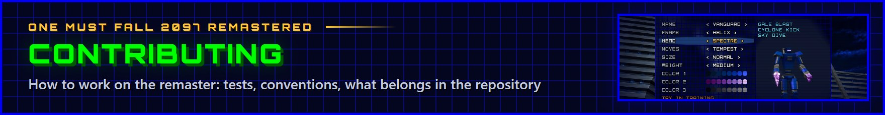

<p align="center"></p>

Thanks for helping keep the robots fighting. This page covers the development setup, the conventions the code
follows, and how to check your changes.

## Setup

You need Node.js 22.12+. The original game's data (freeware, see [NOTICE.md](NOTICE.md)) and the HD artwork come
with the repository:

```sh
npm install
npm run dev            # http://localhost:5173
```

The desktop app additionally needs the Rust and Tauri prerequisites listed in [docs/BUILDING.md](docs/BUILDING.md).

## Checking your changes

```sh
npm run typecheck      # tsc --noEmit
npm test               # vitest: the game logic runs headlessly against the original data
npm run build          # the web build
```

The tests run against the game data in `public/gamedata/` (they skip themselves where it is missing, e.g. in a copy
without it).

The remaster's own robots and arenas are generated from `src/gen` into their mod's package, `public/mods/`
(committed: they come with the game as a mod). After changing their models, moves or scenes, run `npm run gen` (see
[docs/BUILDING.md](docs/BUILDING.md)); a test fails when the robots' files are out of date.

The dev server has a debug API for poking at the running game: `?fight=3&ai` starts a CPU fight in the Fire Pit,
`?scene=MELEE` opens a scene directly, and `window.__omf` offers `step(ms)`, `key(code, down)`, `pointer(kind, x, y)`
and `capture(name, w, h)` (writes a PNG to `.captures/`). See [docs/ARCHITECTURE.md](docs/ARCHITECTURE.md#running).

## Conventions

- **Faithfulness first.** Game logic is a port of the behavior documented by OpenOMF: one TypeScript function per C
  function, the same control flow and constants, integer truncation and the order of random number calls preserved.
  Keep reference quirks and comment them; deviations need a comment explaining why.
- **Cosmetics never touch the simulation.** Remastered effects observe the game through `src/game/fx.ts` events and
  must not change game state or draw from the game's random generators (`src/test/gameplay-options.test.ts` checks
  this).
- **Classic mode stays pixel-exact.** Changes to the remastered renderer must not alter the classic path.
- **Match the surrounding code**: naming, comment density and idioms. The layout of the code is described in
  [docs/ARCHITECTURE.md](docs/ARCHITECTURE.md).

## What not to commit

The original game's files are included on its freeware terms ([NOTICE.md](NOTICE.md)): nothing here may ever be sold
or put behind a charge. Keep other copyrighted material out, and the artwork packs' working files (`hd-pack/`,
`newart-pack/`, source images and prompts) too: only the imported artwork (`public/hd/`, the new robots and arenas'
mod package in `public/mods/`, and the new arenas' paintings in `src/gen/scene/art/`) belongs in the repository.
