<p align="center">
  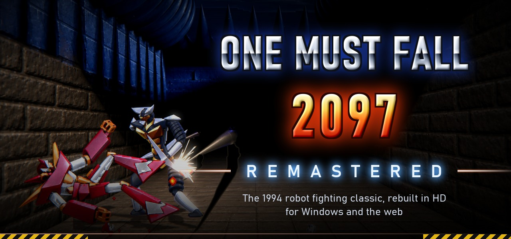
</p>

<p align="center">
  
  
  
  
  
</p>

<p align="center">
  <a href="https://github.com/Jared-woodruff/OMF-2097-Remastered/releases/tag/v0.1.2"></a>
  <a href="docs/manual/OMF-2097-Remastered-Manual.pdf"></a>
</p>

<p align="center">
  <a href="#trailer"><b>Trailer</b></a> &nbsp;•&nbsp;
  <a href="#manual"><b>Manual</b></a> &nbsp;•&nbsp;
  <a href="#features"><b>Features</b></a> &nbsp;•&nbsp;
  <a href="#classic-remastered"><b>Classic / Remastered</b></a> &nbsp;•&nbsp;
  <a href="#effects"><b>Effects</b></a> &nbsp;•&nbsp;
  <a href="#gameplay"><b>Gameplay</b></a> &nbsp;•&nbsp;
  <a href="#screens"><b>Screens</b></a> &nbsp;•&nbsp;
  <a href="#artwork"><b>HD artwork</b></a> &nbsp;•&nbsp;
  <a href="#get-started"><b>Get started</b></a> &nbsp;•&nbsp;
  <a href="#under-the-hood"><b>Under the hood</b></a> &nbsp;•&nbsp;
  <a href="#credits"><b>Credits</b></a>
</p>

<br>

<a id="trailer"></a>

<p align="center">
  <a href="docs/media/trailer.mp4">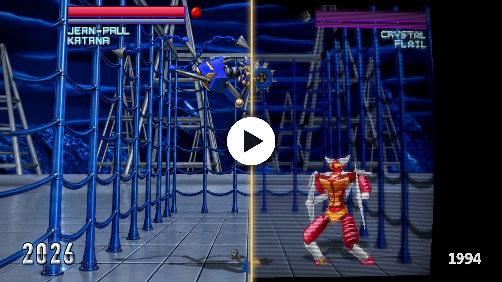</a>
</p>

<p align="center">
  <sub>A fan trailer with no narrator. It starts in 1994: a DOS prompt, then the original game in its own pixels on a
  beige CRT, to its main menu theme (played by this port's music engine). Then, 32 years later, the picture sweeps into
  HD on the drop of Hadal Static's <i>Twenty Ninety-Seven (Remix)</i>: fights at ULTIMATE, the classic look against
  the new one, the new robots and arenas, and every feature, cut to the song's bars (turn the sound on).
  <a href="docs/media/trailer.mp4">Watch it in 1080p60</a>.</sub>
</p>

<br>

**One Must Fall 2097** (Diversions Entertainment, 1994) is the robot fighting game that turned a generation of DOS
players into pilots of 90-foot war machines. This project rebuilds it for today: a faithful reimplementation of the
engine in TypeScript and WebGL2 that plays the **original game data**, runs in any modern browser and as a native
**Windows app**, and lets you flip between the **pixel-exact 1994 look** and a **remastered HD version** at any moment.

<table>
  <tr>
    <td width="33%" valign="top">
      <h3>🎯 Faithful</h3>
      Fight engine, AI, animation scripts, scenes and menus follow the reverse engineering of the
      <a href="https://github.com/omf2097/openomf">OpenOMF</a> project, quirks included. The soundtrack plays through an
      exact port of the game's own MASI music driver.
    </td>
    <td width="33%" valign="top">
      <h3>💎 Remastered</h3>
      3,200+ images redrawn in HD, every sprite rebuilt at your display resolution, a painted parallax main menu,
      widescreen arenas, dynamic lighting, particles, bloom and smooth motion for high refresh rate displays.
    </td>
    <td width="33%" valign="top">
      <h3>🕹️ Modern</h3>
      Replays and clips, a training lab with frame data and combo trials, a robot workshop, arcade, survival and time
      attack modes, custom tournaments, gamepads with rumble, touch controls, one-button specials, and a browser
      version that works offline.
    </td>
  </tr>
</table>

<a id="manual"></a>

<p align="center">
  <a href="docs/manual/OMF-2097-Remastered-Manual.pdf">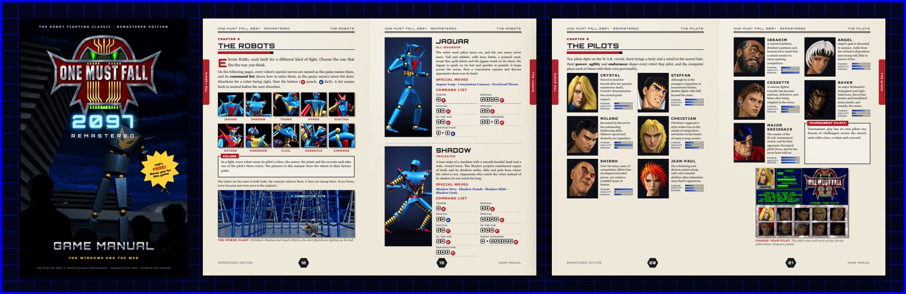</a>
</p>

**📖 The manual.** Games used to come with a booklet, so this one does too: [a 32-page game manual](docs/manual/OMF-2097-Remastered-Manual.pdf)
(PDF) in the style of the 1990s, with the story, the controls, how to fight, every robot's command list, the pilots,
the arenas, the tournament, what's new in the remaster, tips from the pros and troubleshooting. The texts, the stats
and the command lists come from the game's own data.

<br>

<a id="features"></a>
<p align="center"><a href="#features">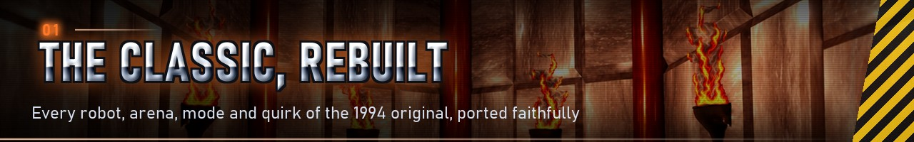</a></p>

The whole game is here, playing the original data files:

- **All 11 robots** (HARs) with every move, special and throw, **10 pilots plus Major Kreissack**, and the CPU
  opponent's personalities and difficulty levels, plus **four new robots** you can turn on (below).
- **The five arenas and their hazards**: the Stadium, the spiked Danger Room, the Power Plant's electrified fences,
  the Fire Pit's fireballs and the Desert's strafing jets, plus **four new arenas** you can turn on (below).
- **Every mode**: one player, two players, demo, the full **tournament** career with the mechlab, upgrades, training
  and newsroom, the scoreboard, the intro and all endings.
- **The original music and sound**: the PSM soundtrack through a port of the MASI driver, the original samples, and
  an optional high quality resampler. Optional additions: **arena acoustics** (the sound effects echo like the
  stadium, the steel Danger Room, the power plant hall, the fire pit or the open desert) and an **impact bass**
  thump under heavy hits, wall slams and knockouts.

<p align="center">
  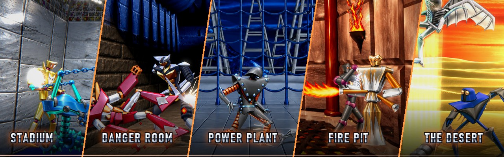
</p>

### New for the remaster: four robots, four arenas

Built for this remaster in the spirit of the originals. They are **off by default**, so the game plays exactly like the
original until you opt in: turn them on in **Gameplay › New content** (robots and arenas separately).

<p align="center">
  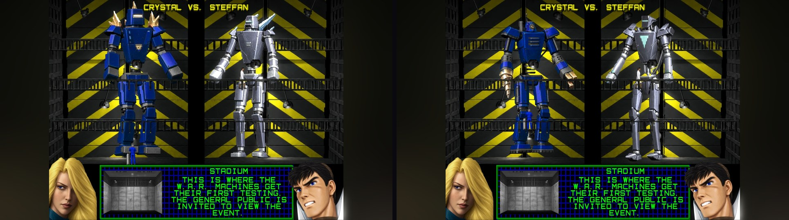
</p>

| Robot | Style | Special moves |
| --- | --- | --- |
| **GLACIER** | Heavy ice juggernaut: slow, strong, tough | **Ice Lance** ↓↘→ P, **Glacial Ram** ↓↙← K, **Frost Spikes** ↓↘→ K |
| **TEMPEST** | Light and fast wind robot, high floaty jumps | **Gale Blast** ↓↙← P, **Cyclone Kick** ↓↘→ K, **Sky Dive** ↓ K in the air |
| **HELIX** | Industrial driller with a spiral drill and a claw | **Drill Rush** ↓↘→ P, **Corkscrew** →↓↘ P, **Drill Bit** ↓↙← P |
| **SPECTRE** | Phantom with forearm lasers and a cloak of blades | **Photon Beam** ↓↘→ P, **Phase Shift** ↓↙← K, **Shadow Strike** ↓↘→ K |

They are built like the originals: faceted armor over slim, ribbed joints, in the player's three colors used the
original way (the armor, the joints, a few signature accents). Their classic sprites are rendered from 3D models and
shaded like the originals' 1994 renders; their HD artwork, every frame of their animations, was painted over those
renders by an image generation model, held to each sprite's outline and color zones so it takes the players' colors
like the originals' artwork. Each has the full basic move set, a throw, a scrap and a destruction finisher, CPU
tactics for its specials and names in the pause menu's move list. Turned on, they sit in a third row of the robot
select screen (move down past the second row), join the CPU opponents, and turn up among the robots Plug offers to
trade in tournaments, with their own turning model and select buttons in the mechlab.

<p align="center">
  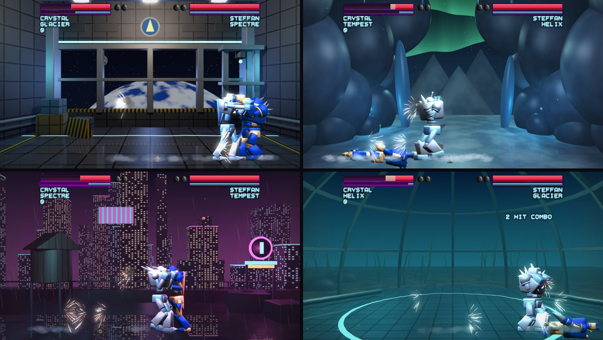
</p>

- **Orbital**: a space station's hangar deck with the Earth in the window. Dust floats, sparks drift in the low
  gravity and the stars twinkle.
- **Ice Cave**: a frozen cavern under the aurora. Snow blows in, frost mist creeps over the ice and the crystals
  sparkle.
- **Rooftop**: a skyscraper roof in the rain, above a neon city. Raindrops splash on the wet roof, lightning flashes
  over the skyline and the neon sign flickers.
- **Abyss**: a glass dome on the sea floor. Bubbles rise, caustics ripple over the floor and light falls from above.

<p align="center">
  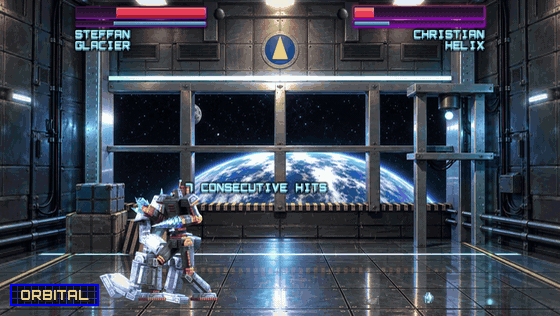
</p>

Turned on, they join the arena rotation of one and two player games and tournaments. All four have true widescreen backgrounds (not
mirrored edges), HD versions, their own acoustics and music. The new
robots bring their own effects too: frost and ice shards, whirlwinds, drill sparks and shavings, laser glow and a
phase-shift shimmer. Everything new is original: the robots and arenas are 3D models in [`src/gen`](src/gen), ray
traced into the game's own formats, and an image generation model painted their HD artwork and the arenas' backgrounds
over those renders (see [docs/ARCHITECTURE.md](docs/ARCHITECTURE.md) and [docs/BUILDING.md](docs/BUILDING.md)).

<br>

<a id="classic-remastered"></a>
<p align="center"><a href="#classic-remastered">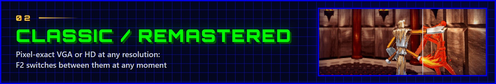</a></p>

<p align="center">
  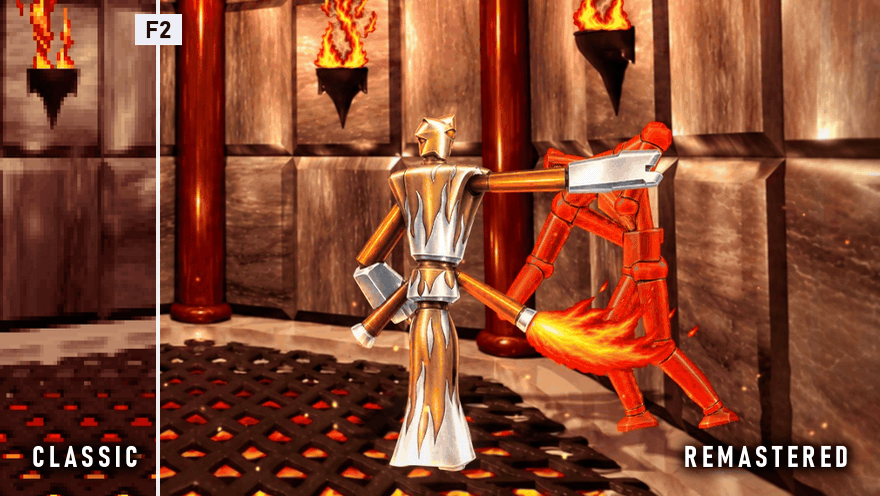
  <br>
  <sub>The same moment in both renderers. <b>F2</b> switches between them at any time, even mid-fight.</sub>
</p>

<table>
  <tr>
    <th width="50%">Classic</th>
    <th width="50%">Remastered</th>
  </tr>
  <tr>
    <td valign="top">
      <ul>
        <li>The original VGA pipeline on the GPU: sprites composited as palette indices into a 320 × 200 framebuffer,
          then resolved through the palette and all 19 remap tables exactly like 1994.</li>
        <li>Sharp pixels, smooth scaling or a CRT scanline filter.</li>
        <li>Optional widescreen for fights.</li>
      </ul>
    </td>
    <td valign="top">
      <ul>
        <li>HD artwork for backgrounds, robots, portraits and effects, or a procedural upscaler (xBR edges plus
          bilateral shading) for anything without it.</li>
        <li>Palette effects still work: player colors, fades, flashes and tints are mapped onto the HD pixels live.</li>
        <li>Widescreen arenas, ambient fill for menus, smooth motion between game ticks, bloom and dynamic resolution.</li>
        <li>A crisp fight HUD: the health and endurance bars drawn as vector graphics in their original colors, with a
          trail that shows the damage just taken and a pulse when health runs low.</li>
        <li>Sharp text at any resolution: a high-resolution typeface fitted into the original fonts' letter cells
          (every text keeps its layout), on frosted-glass panels.</li>
      </ul>
    </td>
  </tr>
</table>

<br>

<a id="effects"></a>
<p align="center"><a href="#effects">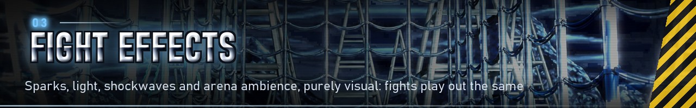</a></p>

Remastered fights get a layer of modern effects, driven by what actually happens in the fight:

<table>
  <tr>
    <td width="50%" valign="top">
      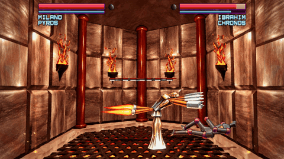
      <br><b>Fire Pit</b>: rising embers, torchlight on the robots and heat haze over the grate.
    </td>
    <td width="50%" valign="top">
      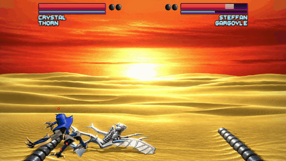
      <br><b>The Desert</b>: backlight from the sunset, sun shafts and sand blowing over the dunes.
    </td>
  </tr>
  <tr>
    <td width="50%" valign="top">
      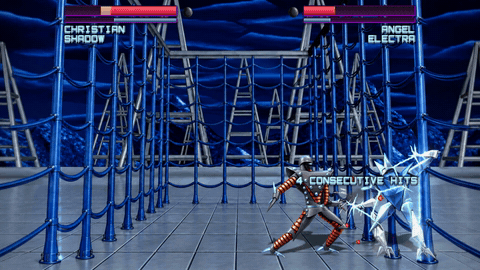
      <br><b>Power Plant</b>: the electrified fences throw blue light across the whole arena.
    </td>
    <td width="50%" valign="top">
      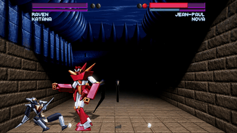
      <br><b>Knockouts</b>: a flash, a shockwave, a burst of sparks and a slow-motion zoom on the final blow.
    </td>
  </tr>
</table>

| Group | What it adds |
| --- | --- |
| **Particles** | Sparks and impact flares on hits and blocks, dust from falls, throws and wall slams. |
| **Lighting** | Impacts, fire, energy and projectiles light up the arena and the robots; each arena lights the robots' edges. |
| **Impact FX** | Shockwaves on heavy hits, and the knockout camera with flash and chromatic aberration. |
| **Atmosphere** | Embers and heat haze, blowing sand, drifting dust, floodlight glow and camera flashes in the crowd; in the new arenas snow, frost mist, aurora light, rain and splashes, lightning, neon flicker, bubbles and caustics. |

In widescreen the arena's painting reaches past the fighting area, whose edges are those of the original screen: they
show as faint energy curtains in the arena's light, which glow where a robot is held against them and flare and ripple
when one is slammed into them.

> [!NOTE]
> The effects are purely cosmetic. They never touch the game state or its random number generators, so a fight
> plays out exactly the same with them on or off, and a test checks that. Each group can be switched off in
> **Configuration › Video › Remastered options**.

<br>

<a id="gameplay"></a>
<p align="center"><a href="#gameplay">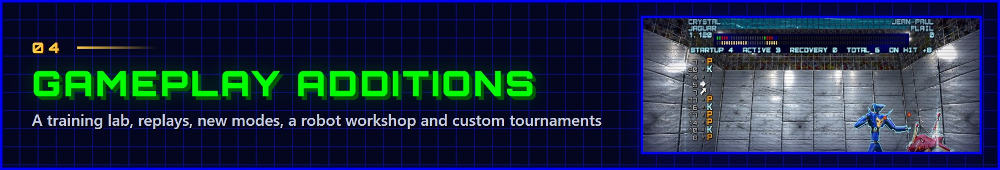</a></p>

<p align="center">
  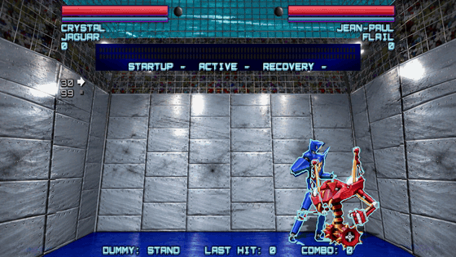
</p>

Everything below is new, and none of it changes how the original game plays unless you use it.

#### Training lab

**Training** (main menu, where network play used to be) puts you against a dummy with nobody getting knocked out and
health refilling after every combo. The pause menu's **Training lab** adds the tools of modern fighting games:

<p align="center">
  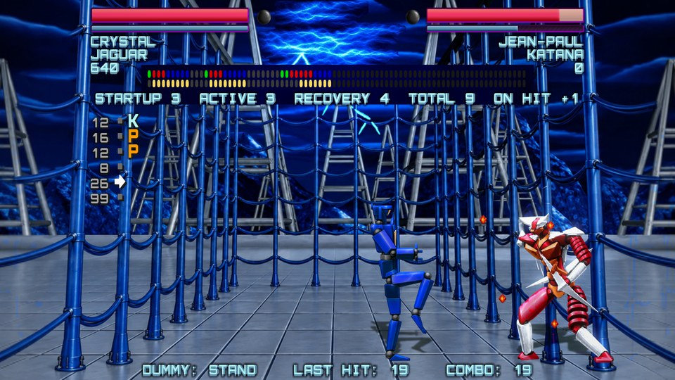
  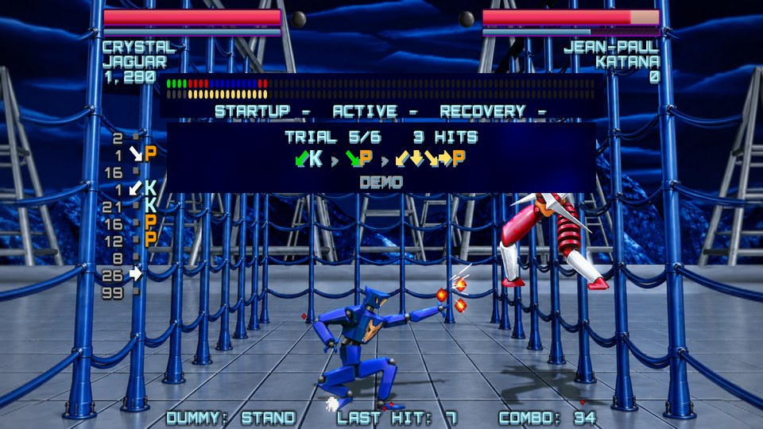
</p>

- **Frame data**: a frame meter for both robots (startup, active, recovery, hit and block stun) and the startup,
  active and recovery frames of your last move with the advantage after it hit or was blocked. <kbd>F8</kbd>
- **Hitboxes**: what can be hit (outlined) and the hit points of attacks. Hits in this game are pixel exact: a hit
  lands where a hit point touches the other robot. <kbd>F9</kbd>
- **Record the dummy**: take control of the dummy and record what it should do (up to 25 seconds), then let it play
  it back over and over, or once. <kbd>F5</kbd> / <kbd>F6</kbd>
- **Reversals**: the dummy answers the moment it can act after a hit, a block or a knockdown, with a jump, your
  recording, or any of its special moves and throws, on the first possible frame.
- **Combo trials** for every robot: its special moves, then combos found by a search of the game itself (every timing
  of two and three moves tried against a standing dummy; each trial is checked against all eleven robots as the
  dummy, and a test replays them all). Each trial has a demo. <kbd>F4</kbd> resets.
- The **input display** lists your recent inputs with how long each was held.

#### Replays and clips

**Every fight is saved** (Extras › Replays keeps the last 40, plus any you mark to keep). Watch them again at any
speed from ¼ to 4×, pause, step one frame at a time, jump anywhere on the timeline, and share the fights as `.rec`
files (the original game's recording format). Mark a clip and save it as an **MP4 video** with the game's sound or
as an **animated GIF**.

<p align="center">
  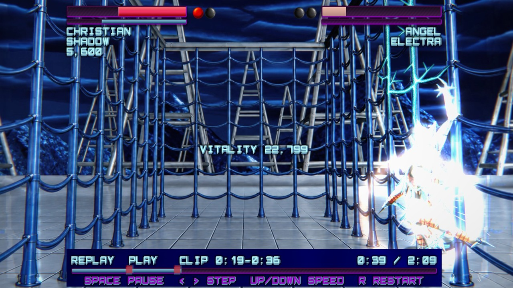
</p>

#### Arcade, survival, time attack

- **Arcade**: eight fights, the computer better and better, Kreissack last.
- **Survival**: one round against one opponent after another with the health you have left.
- **Time attack**: five fights against the clock.
- **Records**: statistics, the best results of each mode and 20 achievements (for bragging rights: nothing is
  locked behind them).

#### Robot workshop

Build your own robots from the new robots' parts: the frame of one, the head of another, the special moves and
finishers of a third, a size, a weight class and three colors, with a live picture as you go. The game builds a full
fighter from it on the spot (every sprite, move and hit point, and the HD artwork), ready to try in training or
against the computer. Robots are shared as small `.omfbot` files.

<p align="center">
  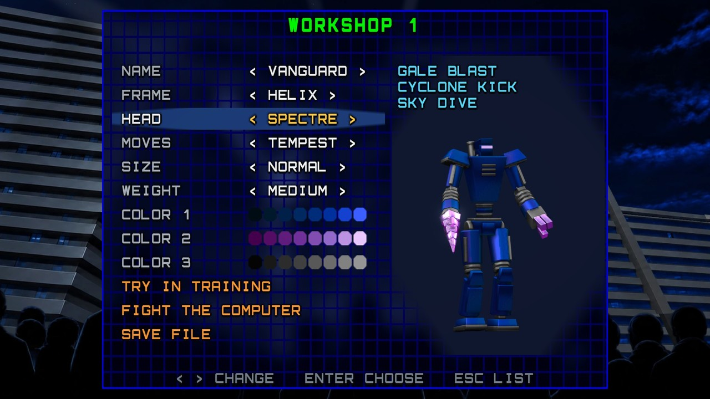
</p>

#### Custom tournaments

Make your own tournaments from the installed ones: fewer opponents (spread over the ranks, the champion always among
them), their robots as they were or on the new robots, more or less prize money. They show up in **Tournament play**
like the others and are shared as `.omftrn` files. The new arenas join the tournament's arenas too when they are on.

#### Presentation

- **Main menu** (remastered graphics): the robot on its stage is a parallax scene of painted layers under a slowly
  drifting camera that leans toward the mouse, lit live like the original: the spotlight sweeps over the robot and the
  tower's top, its beam hangs in the haze, searchlights cross the sky and cameras flash in the crowd.
- **Two announcers**: a male and a female voice (**Configuration › Audio › Announcer**) call the rounds, "Fight!",
  knockouts, perfects, scraps and destructions, and the winners: Victor, deep and ominous, and Kristen, icy and
  commanding (voices from the [ElevenLabs](https://elevenlabs.io) library, performed with Eleven v4 and directed line
  by line). While one of them speaks, the original game's own announcer ("Ready", "Round", "Fight") stays quiet; turn
  the announcer off to hear it again. The lines are plain MP3 files in
  [`public/audio/announcer`](public/audio/announcer) (one folder per voice): replace any of them with your own recording.
- **The newsreader**: after single player and tournament fights, the TV news report is read aloud in the announcer's
  voice, every report with its pilots, robots and arena. The game assembles each reading from recordings of the
  report's text and of the names, each name said the way its place in the sentence needs; a name you typed in
  yourself is read as "the challenger".
- **Victory screens**: after one and two player fights, the winner's portrait and robot with a line of theirs and
  the fight in numbers (rounds, time, hits, accuracy, best combo, perfects and finishers).
- **Fight camera** (optional, remastered graphics): the view comes closer when the robots are close and follows the
  fight, while the HUD stays put.
- **Remaster credits** (Extras › Credits): the credits are fought out. Every credit pilots one of the original robots
  in its own colors (Claude's coral and cream, OpenAI's black, white and green...) and wins a quick, brutal fight in one
  of the original arenas against something the remaster had to beat: tech debt, spaghetti code, pixel noise, dead air,
  silence, a black box and time itself. The computer fights both sides at ULTIMATE in HYPER mode, and every fight ends
  with a SCRAP or a DESTRUCTION. Each opens on a VS card and ends on the winner's card, then come the end titles, all to
  [*Twenty Ninety-Seven (Remix)*](https://www.hadalstatic.com/releases/twenty-ninety-seven/) by Hadal Static, a song about
  *One Must Fall 2097*. ENTER skips ahead, ESC goes back.
- **Achievements** announce themselves with a banner the moment they are earned.
- **The game manual**: a [32-page PDF booklet](docs/manual/OMF-2097-Remastered-Manual.pdf) in the style of the
  1990s (see [above](#manual)); the F1 help's pointers to the DOS-era manual now lead to it.

<p align="center">
  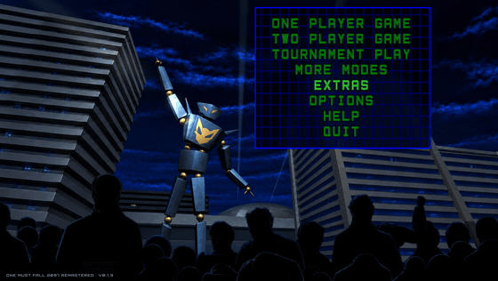
</p>

<p align="center">
  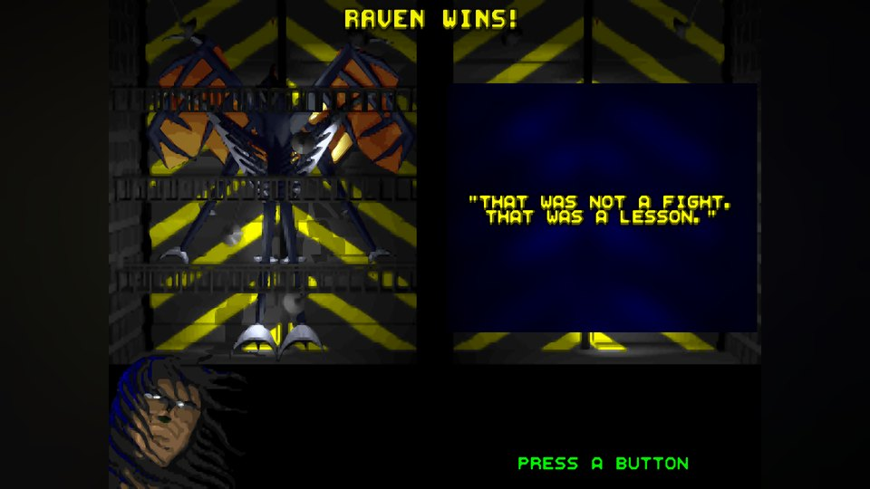
</p>

<p align="center">
  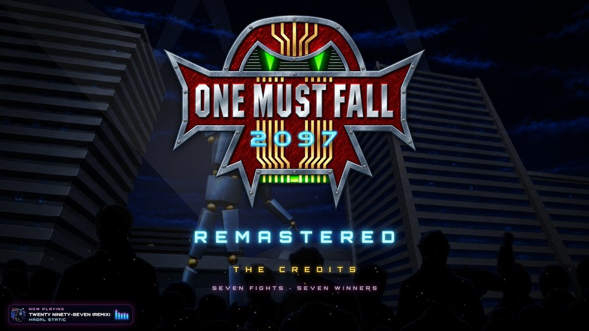
  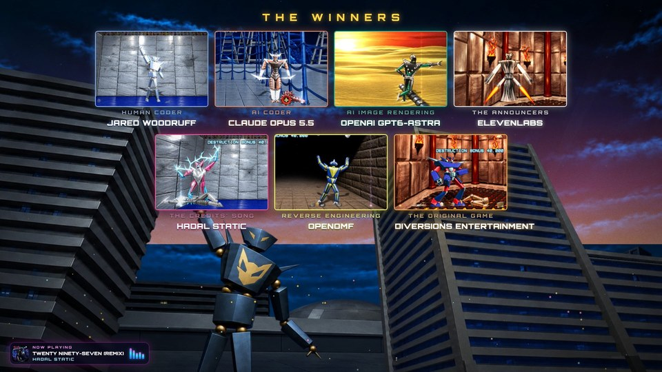
</p>

#### And also

- **Move lists** in the pause menu: the special moves, throws and finishing moves of both robots, read from the
  game's own move tables and shown with direction arrows.
- **The advanced options the original promised**: *Defensive throws*, *Knock down* and *Block damage* were listed in
  the 1994 menus but never implemented by OpenOMF. They now work as the original help text describes.
- **Gamepad rumble** on hits, blocks, throws, wall slams and knockouts.
- **Mouse support** in every menu: hover to select, click to activate, scroll to change values, right click to go back.
- **F1 help at any time**, as the original help pages promised, with the game paused behind it.
- **The German texts as written**: umlauts in the remastered typeface, the help pages' highlighted words in their
  colors on the same line, and pages longer than the screen continued over more pages.
- **Auto pause**: switching to another window or tab pauses a fight.

<br>

<a id="screens"></a>
<p align="center"><a href="#screens">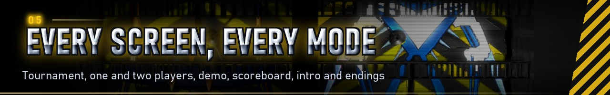</a></p>

<p align="center">
  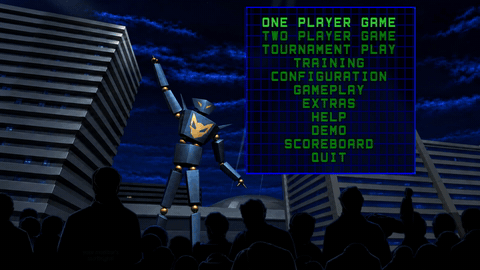
  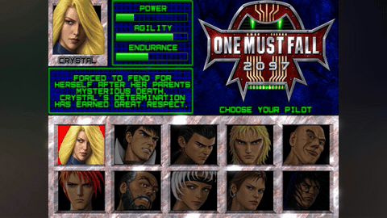
</p>
<p align="center">
  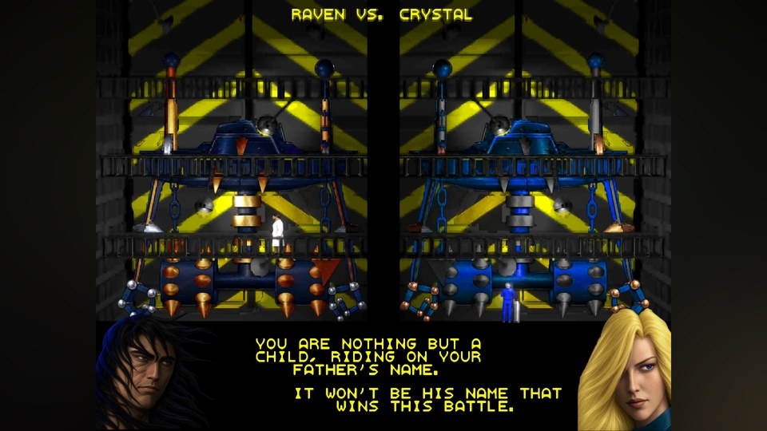
  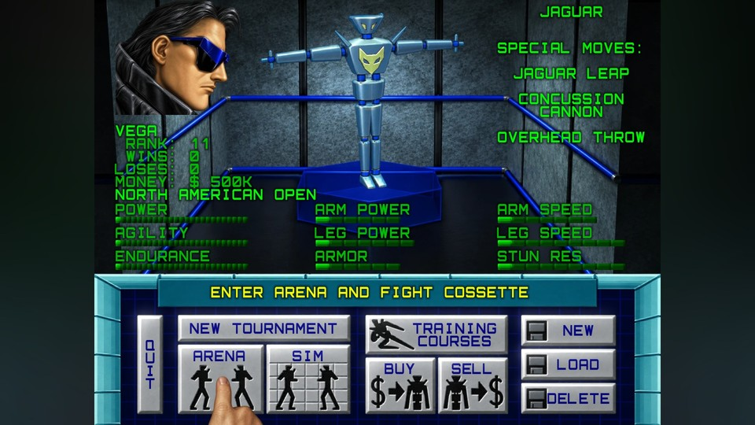
</p>
<p align="center">
  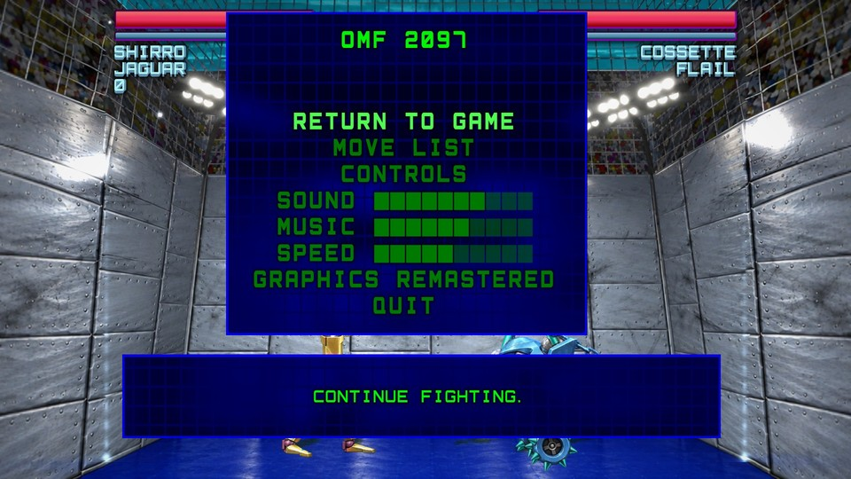
  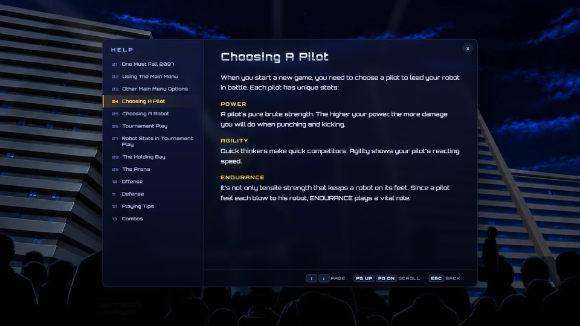
</p>
<p align="center">
  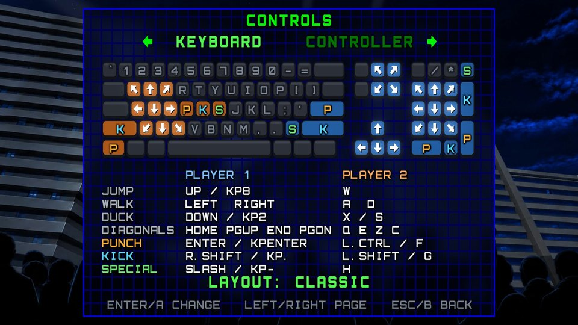
  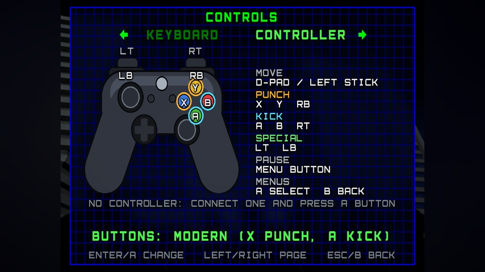
</p>

Every menu and text of the game was audited: a layout test checks that each entry fits its frame and each help text
fits its panel, and a text audit reports anything cut off or drawn off screen in every scene the tests visit.
Dialogs grow to fit their message. In remastered mode text is set in a high-resolution typeface in the style of
the original fonts (Orbitron, fitted into the originals' letter cells, so every line, menu and dialog keeps its layout,
and sharp even at 4K), with a soft shadow; **Remastered options › Font** switches to the original letters drawn as
clean shapes or as crisp pixels. Darkened panels such as menus, dialogs and the newsroom's report get a frosted-glass
background, so text stays readable over detailed HD artwork.

<br>

<a id="artwork"></a>
<p align="center"><a href="#artwork">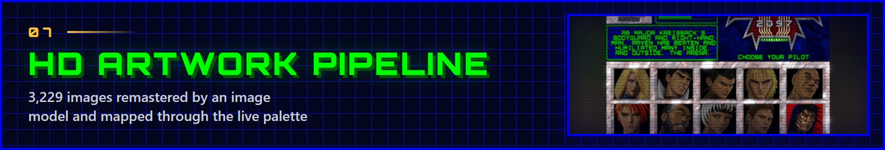</a></p>

The HD artwork was produced with an image generation model from the original images, then imported into texture
atlases the game loads on demand:

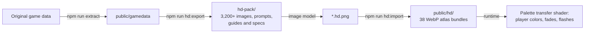
```mermaid
flowchart LR
    A["Original game data"] -->|npm run extract| B["public/gamedata"]
    B -->|npm run hd:export| C["hd-pack/<br/>3,200+ images, prompts,<br/>guides and specs"]
    C -->|image model| D["*.hd.png"]
    D -->|npm run hd:import| E["public/hd/<br/>38 WebP atlas bundles"]
    E -->|runtime| F["Palette transfer shader:<br/>player colors, fades, flashes"]
```

- **No game code changes needed**: surfaces are matched to their artwork by a fingerprint of their palette indices.
- **Live colors**: each HD pixel is mapped through the palette change of the original pixel it belongs to, so the
  artwork follows player color choices, fades, flashes and tints exactly like the original sprites.
- **Streaming**: bundles per scene, robot and shared effects load on demand, and scene changes preload the next ones.
- **The new robots and arenas** have a pack of their own (`npm run newart:export` / `newart:import`): each arena is
  painted again as one widescreen picture, and each robot gets a design sheet and then every frame redrawn from it,
  clipped to the sprite's outline when imported.

The imported artwork is part of this repository (`public/hd/`, shared on the game's freeware terms, see
[NOTICE.md](NOTICE.md)); the pack's working files are not. See [docs/BUILDING.md](docs/BUILDING.md) to make and import
a pack of your own.

<br>

<a id="get-started"></a>
<p align="center"><a href="#get-started">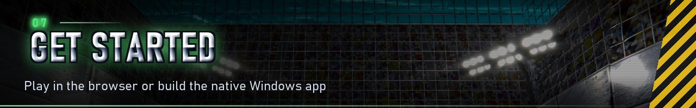</a></p>

**To play**, download version 0.1.2 for Windows: the
[installer](https://github.com/Jared-woodruff/OMF-2097-Remastered/releases/download/v0.1.2/OMF-2097-Remastered-0.1.2-setup.exe), or the portable
[`omf2097-remastered.exe`](https://github.com/Jared-woodruff/OMF-2097-Remastered/releases/download/v0.1.2/omf2097-remastered.exe) that runs from anywhere
([release notes](https://github.com/Jared-woodruff/OMF-2097-Remastered/releases/tag/v0.1.2)). Everything is included and free: *One Must Fall 2097* has been
freeware since 1999, and its owners let everyone share it as long as nobody charges for it (see [NOTICE.md](NOTICE.md)).
New to the game? The [manual](docs/manual/OMF-2097-Remastered-Manual.pdf) has a quick start on page 2.

**To build it yourself**, the game data and the HD artwork come with the repository:

```sh
git clone https://github.com/Jared-woodruff/OMF-2097-Remastered.git
cd OMF-2097-Remastered
npm install
npm run dev                      # play at http://localhost:5173
```

| Command | Result |
| --- | --- |
| `npm run build` | The web version in `dist/`: a static site you can host anywhere, even in a subfolder. The game starts with one click, and works offline as an installable app after the first visit. |
| `npm run build:web -- --lean` | The same site without the game data and the artwork (0.5 MB): on the first visit, players drop the freeware `OMF21.EXE` (or a zip, or their game folder) onto the page, and it is unpacked in the browser and kept there. |
| `npm run extract` | Replaces the game data with your own copy's (`omf21cd/` with the CD contents, or `npm run extract -- path/to/OMF21.EXE`). |
| `npm run desktop:build` | The Windows app: a portable `omf2097-remastered.exe` and an installer under `src-tauri/target/release/`. |
| `npm test` | The test suite (headless, against the game data). |
| `npm run manual` | The game manual, `docs/manual/OMF-2097-Remastered-Manual.pdf` (printed by Microsoft Edge, Windows). |

Prerequisites and details for every platform are in [docs/BUILDING.md](docs/BUILDING.md).

### Controls

| | Player 1 | Player 2 |
| --- | --- | --- |
| Move / jump / duck | Arrow keys, Home / PgUp / End / PgDn for diagonals (or the numpad) | Q W E / A D / Z X C |
| Punch | Enter | Left Ctrl or F |
| Kick | Right Shift | Left Shift or G |
| Special (one press) | / or numpad − | H |

<kbd>Esc</kbd> pause menu &nbsp;·&nbsp; <kbd>F1</kbd> help &nbsp;·&nbsp; <kbd>F2</kbd> classic / remastered &nbsp;·&nbsp;
<kbd>F3</kbd> next song (your own music) &nbsp;·&nbsp; <kbd>F11</kbd> or <kbd>Alt</kbd>+<kbd>Enter</kbd> fullscreen
&nbsp;·&nbsp; <kbd>Print Screen</kbd> (or <kbd>F12</kbd> in the desktop app) saves a screenshot at your display's
resolution.

- **Configuration › Controls** (also in the pause menu) shows the keyboard and the Xbox controller with every action
  on its key or button. The keyboard has the classic layout above and a **modern** one (WASD for player 1), and keys
  can be rebound in **Configuration › Input**.
- **Xbox controllers** (and other standard gamepads) work out of the box, even alongside the keyboard: X / Y / RB
  punch and A / B / RT kick in the modern layout, or the original's two-button scheme in the classic one.
- **One-button specials** (**Configuration › Special button**, on by default): the special button with no
  direction, forward, back, down or up does the robot's first to fifth special move, and its air special in a jump;
  the move list shows which is which. The original inputs work as always. On a controller it is LT (and LB or RT).
- **Touch controls** for phones and tablets: a stick that appears under your left thumb, punch, kick and special
  buttons and a pause button. They show up once the screen is touched (**Configuration › Touch pad**).
- **Training**: <kbd>F4</kbd> reset positions, <kbd>F5</kbd> record the dummy, <kbd>F6</kbd> play the recording (or a
  trial's demo), <kbd>F8</kbd> frame data, <kbd>F9</kbd> hitboxes.
- **Replays**: <kbd>Space</kbd> pause, <kbd>←</kbd> <kbd>→</kbd> step (or skip five seconds while playing),
  <kbd>↑</kbd> <kbd>↓</kbd> speed, <kbd>R</kbd> restart, <kbd>I</kbd> / <kbd>O</kbd> clip start and end, <kbd>V</kbd>
  save a video, <kbd>G</kbd> save a GIF, <kbd>K</kbd> keep, <kbd>H</kbd> hide the bar. The desktop app saves clips and
  files in *Downloads\OMF 2097 Remastered*.
- **Sound effects and music volume** are in **Configuration › Audio** and the pause menu, with the **announcer**.
  **My music** plays your own songs in fights or everywhere: drop audio files onto the window (or pick them in the
  Audio menu).

<br>

<a id="under-the-hood"></a>
<p align="center"><a href="#under-the-hood">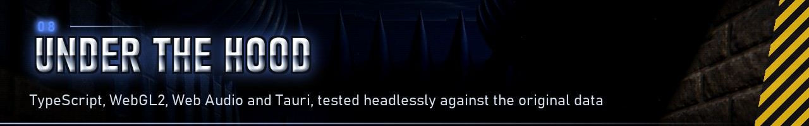</a></p>

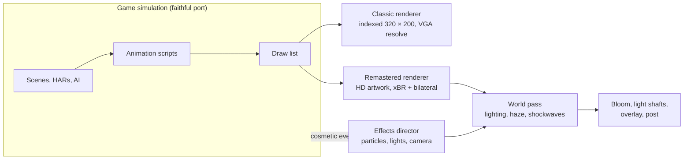
```mermaid
flowchart LR
    subgraph sim["Game simulation (faithful port)"]
        S1["Scenes, HARs, AI"] --> S2["Animation scripts"] --> S3["Draw list"]
    end
    S3 --> CL["Classic renderer<br/>indexed 320 × 200, VGA resolve"]
    S3 --> RM["Remastered renderer<br/>HD artwork, xBR + bilateral"]
    sim -. "cosmetic events" .-> FX["Effects director<br/>particles, lights, camera"]
    FX --> WP["World pass<br/>lighting, haze, shockwaves"]
    RM --> WP --> PP["Bloom, light shafts,<br/>overlay, post"]
```

| Layer | Technology |
| --- | --- |
| Language and build | TypeScript 7, Vite 8 |
| Rendering | WebGL2: classic VGA pipeline, HD reconstruction, particle, lighting and post-processing passes |
| Audio | Web Audio with an AudioWorklet mixer and a port of the MASI PSM music driver |
| Desktop | Tauri 2 (WebView2), a portable exe and an installer |
| Tests | Vitest, 260 tests running the real game logic headlessly against the original data |

- The remastered renderer measures its GPU time and lowers its internal resolution when a GPU can't keep up. With
  every effect on, a frame takes about 8 ms of GPU time at 1920 × 1200 on an RTX 4080.
- [docs/ARCHITECTURE.md](docs/ARCHITECTURE.md) explains how the code is organized and how the C reference maps to it.
- `?fight=3&ai` in the dev server's URL starts a CPU fight in the Fire Pit and `?training` goes straight to training
  mode; `window.__omf` exposes a debug API for stepping, input and captures.

<br>

<a id="credits"></a>
<p align="center"><a href="#credits">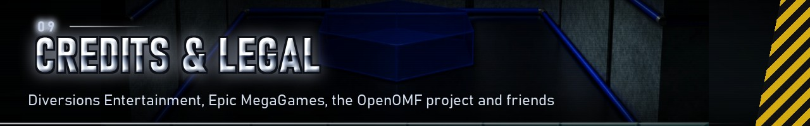</a></p>

- **The remaster**: [Jared Woodruff](https://github.com/Jared-woodruff) (human coder), Claude Opus 5.5 in Max Mode (AI
  coder), OpenAI GPT6-ASTRA in Ultra Mode (AI image rendering of the HD artwork).
- **The credits' song**: [*Twenty Ninety-Seven (Remix)*](https://www.hadalstatic.com/releases/twenty-ninety-seven/) by
  Hadal Static, used with the artist's permission.
- ***One Must Fall 2097*** © 1994 Diversions Entertainment, published by Epic MegaGames, freeware since 1999. All
  trademarks belong to their owners. This is an unofficial fan project, not affiliated with or endorsed by the
  original authors.
- **[OpenOMF](https://github.com/omf2097/openomf)** (MIT license): the open-source reimplementation whose reverse
  engineering this port follows.
- **Hyllian's xBR-lv2 shader** (MIT license): adapted for the remastered sprite reconstruction.
- **The announcers' voices**: made with [ElevenLabs](https://elevenlabs.io) Eleven v4 text to speech (the voices Victor
  and Kristen from its voice library) and finished with **FFmpeg** (LGPL/GPL, used as a tool, not part of the game).
- **[Tauri](https://tauri.app)** (MIT / Apache-2.0): the desktop app. Built with Vite, TypeScript and Vitest.
- **[Orbitron](https://github.com/theleagueof/orbitron)** by Matt McInerney and The League of Moveable Type
  ([SIL Open Font License 1.1](public/fonts/Orbitron-OFL.txt)): the remastered text.
- The app icon and installer artwork are original designs; the HD artwork was generated from the original images,
  and the new robots' and arenas' from the remaster's own renders.

The source code in this repository is released under the [MIT license](LICENSE). The original game's data files and
the remastered artwork made from them are included on the game's freeware terms, not under the MIT license: free of
charge, never sold. See [NOTICE.md](NOTICE.md).

<br>

<p align="center">
  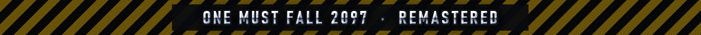
</p>
