<p align="center">
  
</p>

<p align="center">
  <a href="https://github.com/Jared-woodruff/OMF-2097-Remastered/releases/latest"></a>
  <a href="#trailer">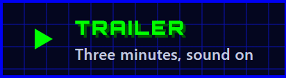</a>
  <a href="docs/manual/OMF-2097-Remastered-Manual.pdf">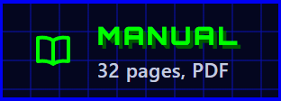</a>
  <a href="#mods">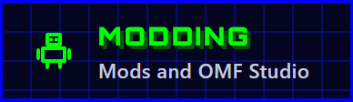</a>
</p>

<a id="trailer"></a>

https://github.com/user-attachments/assets/3c2f7574-e944-42c4-b5b6-c7361e1e6be7

<p align="center">
  <sub><b>Sound on.</b> A fan trailer: 1994 on an old PC in the game's colors, then 32 years later in HD, the new robots
  and arenas, and a mod made from scratch in OMF Studio, cut to Hadal Static's <i>Twenty Ninety-Seven (Remix)</i>.
  <a href="docs/media/trailer.mp4">Watch it in 1080p60</a>.</sub>
</p>

## The robot fighting classic, rebuilt

In **One Must Fall 2097** (Diversions Entertainment, 1994), pilots climb into 90-foot war machines and fight their way
up a corporate tournament. It was one of the great DOS fighting games, and it has been **freeware since 1999**.

**This project brings it back.** It is a faithful reimplementation of the game's engine that plays the **original game
files**, as a free **Windows app** or in a **browser**. Play it exactly as it looked in 1994, or **remastered in HD**
with new effects, modes and tools. One key, <kbd>F2</kbd>, switches between the two at any moment, even mid-fight.

<table>
  <tr>
    <td width="33%" valign="top">
      <h3>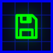 Faithful</h3>
      Every robot, arena, mode and quirk of the original, following the reverse engineering of
      <a href="https://github.com/omf2097/openomf">OpenOMF</a>. The soundtrack plays through a port of the game's own
      music driver.
    </td>
    <td width="33%" valign="top">
      <h3> Remastered</h3>
      3,200+ images redrawn in HD, widescreen arenas with depth, dynamic light and particles, smooth motion, and sharp
      text at any resolution.
    </td>
    <td width="33%" valign="top">
      <h3> Modern</h3>
      A training lab, replays and clips, new modes, a robot workshop, mods and the OMF Studio mod tools, gamepads with
      rumble, touch controls, and it works offline.
    </td>
  </tr>
</table>

<p align="center">
  <a href="#play">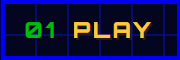</a>
  <a href="#classic-remastered">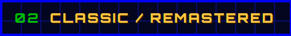</a>
  <a href="#the-game">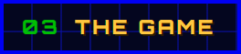</a>
  <a href="#effects">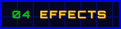</a>
  <a href="#new-ways-to-play">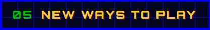</a>
  <a href="#new-robots-and-arenas">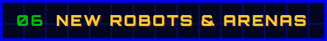</a>
  <a href="#mods">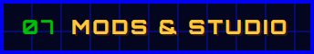</a>
  <a href="#build">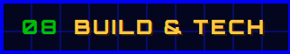</a>
  <a href="#credits">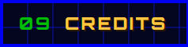</a>
</p>

<br>

<a id="play"></a>
<p align="center"><a href="#play">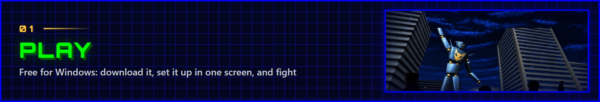</a></p>

**Download the game for Windows, free** (version 0.2.0):

- **[The installer](https://github.com/Jared-woodruff/OMF-2097-Remastered/releases/download/v0.2.0/OMF-2097-Remastered-0.2.0-setup.exe)**
  adds the game to the Start menu (and, if you like, OMF Studio).
- **[The portable app](https://github.com/Jared-woodruff/OMF-2097-Remastered/releases/download/v0.2.0/omf2097-remastered.exe)**
  is a single file that runs from anywhere.
- **[OMF Studio](https://github.com/Jared-woodruff/OMF-2097-Remastered/releases/download/v0.2.0/omf-studio.exe)**, the
  mod tools, is the same single file opening straight into Studio.

Everything is included: the game, its HD artwork and its music, about 240 MB. It runs on Windows 10 and 11. The
[release notes](https://github.com/Jared-woodruff/OMF-2097-Remastered/releases/tag/v0.2.0) list what's new. Rather play
in a browser? The game runs in any modern one too: [build the web version](#build) and put it anywhere.

**On the first start**, one screen sets you up: the original 1994 look in a single press, or the remastered graphics,
effects, announcer and music the way you like them. Everything can be changed later in **Options**.

**Games used to come with a booklet, so this one does too.** The [32-page manual](docs/manual/OMF-2097-Remastered-Manual.pdf)
has the story, the controls, how to fight, every robot's moves, the pilots, the arenas and tips from the pros, with a
one-page quick start on page 2.

<p align="center">
  <a href="docs/manual/OMF-2097-Remastered-Manual.pdf"></a>
</p>

### Controls

| | Player 1 | Player 2 |
| --- | --- | --- |
| **Move, jump, duck** | Arrow keys (Home, PgUp, End, PgDn for diagonals) or the numpad | Q W E, A D, Z X C |
| **Punch** | Enter | Left Ctrl or F |
| **Kick** | Right Shift | Left Shift or G |
| **Special** (one press) | / or numpad − | H |

<kbd>Esc</kbd> pause &nbsp;·&nbsp; <kbd>F1</kbd> help &nbsp;·&nbsp; <kbd>F2</kbd> classic or remastered &nbsp;·&nbsp;
<kbd>F11</kbd> fullscreen &nbsp;·&nbsp; <kbd>Print Screen</kbd> screenshot

<details>
<summary><b>Gamepads, touch screens, one-button specials and every other key</b></summary>

<br>

- **Gamepads** (Xbox and other standard controllers) work out of the box, even beside the keyboard: X, Y or RB
  punch, A, B or RT kick, LT or LB fire a special (or the classic layout: A punch, B kick). They rumble with hits,
  blocks, throws, wall slams and knockouts.
- **One-button specials** (on from the start, **Options › Controls › Special button**): the special button alone, or
  with forward, back, down or up, fires one of the robot's special moves, and its air special in a jump. The original
  motions work as always.
- **Your own keys**: a modern keyboard layout (WASD for player 1), and any key rebound in **Options › Controls**.
  **Keys and buttons** (also in the pause menu) shows every action on the keyboard and the controller.
- **Touch controls** on phones and tablets: a stick under your left thumb, punch, kick, special and pause buttons.
- **Anywhere**: <kbd>F3</kbd> next song (your own music), <kbd>Alt</kbd>+<kbd>Enter</kbd> fullscreen, <kbd>F12</kbd>
  screenshot (in the Windows app; screenshots, clips and videos go to *Downloads\OMF 2097 Remastered*). The mouse
  works in every menu.
- **Training**: <kbd>F4</kbd> reset, <kbd>F5</kbd> record the dummy, <kbd>F6</kbd> play it back, <kbd>F8</kbd> frame
  data, <kbd>F9</kbd> hitboxes.
- **Replays**: <kbd>Space</kbd> pause, <kbd>←</kbd> <kbd>→</kbd> step (or skip ahead while playing), <kbd>↑</kbd>
  <kbd>↓</kbd> speed, <kbd>I</kbd> <kbd>O</kbd> mark a clip, <kbd>V</kbd> save it as a video, <kbd>G</kbd> as a GIF,
  <kbd>K</kbd> keep the replay.

<p align="center">
  
  
</p>

</details>

<br>

<a id="classic-remastered"></a>
<p align="center"><a href="#classic-remastered"></a></p>

<p align="center">
  
  <br>
  <sub>The same moment, both ways. <kbd>F2</kbd> switches at any time.</sub>
</p>

<table>
  <tr>
    <th width="50%">Classic</th>
    <th width="50%">Remastered</th>
  </tr>
  <tr>
    <td valign="top">

- The original VGA picture, rebuilt on the GPU: 320 × 200 pixels through the game's palette and its 19 color tables,
  exactly like 1994
- Sharp pixels, smooth scaling or a CRT filter
- Widescreen fights if you want them

</td>
    <td valign="top">

- HD artwork for every arena, robot, portrait and effect, and an edge-aware upscaler for anything else
- Player colors, fades and flashes still work: they are mapped onto the HD pixels live
- Widescreen arenas whose paintings have depth: the camera's moves give them parallax, and light falls on them by their
  shape
- Smooth motion between game ticks, bloom, a crisp HUD, and text in a sharp typeface fitted to the original fonts

</td>
  </tr>
</table>

<br>

<a id="the-game"></a>
<p align="center"><a href="#the-game">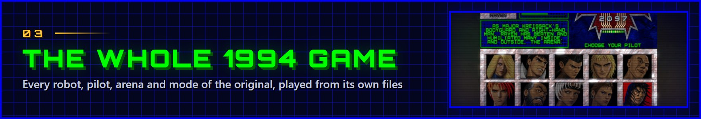</a></p>

Everything from the original is here, playing its own data files:

- **11 robots**, every move, special and throw, and **10 pilots plus Major Kreissack**, each fighting their own way.
- **5 arenas and their hazards**: the Danger Room's spikes, the Power Plant's electrified fences, the Fire Pit's
  fireballs and the Desert's strafing jets.
- **Every mode**: one and two players, the demo, the full **tournament** career with the mech lab, upgrades, training
  and the newsroom, the scoreboard, the intro and every ending.
- **The original music and sounds**, through a port of the game's own music driver.

<p align="center">
  
</p>

<p align="center">
  
  
</p>
<p align="center">
  
  
</p>
<p align="center">
  
  
</p>

The menus were tidied up without losing anything: the three ways to play first, then **More modes**, **Extras** and
**Options**. And a few things the 1994 menus promised now work, like the *defensive throws*, *knock down* and *block
damage* rules.

<br>

<a id="effects"></a>
<p align="center"><a href="#effects"></a></p>

Remastered fights get a layer of modern effects, driven by what happens in the fight:

<table>
  <tr>
    <td width="50%" valign="top">
      
      <br><b>Fire Pit</b>: rising embers, torchlight on the robots, heat haze over the grate.
    </td>
    <td width="50%" valign="top">
      
      <br><b>The Desert</b>: the sunset behind the robots, sun shafts, sand blowing over the dunes.
    </td>
  </tr>
  <tr>
    <td width="50%" valign="top">
      
      <br><b>Power Plant</b>: the electrified fences throw blue light across the arena.
    </td>
    <td width="50%" valign="top">
      
      <br><b>Knockouts</b>: a flash, a shockwave, sparks and a slow-motion zoom on the final blow.
    </td>
  </tr>
</table>

| Effects | What they add |
| --- | --- |
| **Particles** | Sparks and flares on hits and blocks, dust from falls, throws and wall slams |
| **Lighting** | Hits, fire, energy and projectiles light up the arena and the robots |
| **Impact** | Shockwaves on heavy hits, the knockout camera |
| **Atmosphere** | Each arena's own: embers, sand, dust, floodlights, camera flashes in the crowd, and in the new arenas snow, aurora, rain, lightning, neon and bubbles |

> [!NOTE]
> The effects are only for the eyes. They never touch the game's state or its random numbers, so a fight plays out
> exactly the same with them on or off (a test checks it). Each group can be turned off in **Options › Graphics ›
> Effects**.

<br>

<a id="new-ways-to-play"></a>
<p align="center"><a href="#new-ways-to-play"></a></p>

All of this is new, and none of it changes how the original plays unless you use it.

### Training lab

<p align="center">
  
</p>

**Training** (in **More modes**) puts you against a dummy that never goes down, with health that refills after every
combo. The pause menu's **Training lab** brings the tools of modern fighting games:

- **Frame data** for both robots (startup, active, recovery, advantage) and **hitboxes**: hits in this game are pixel
  exact, and you can see why.
- **Record the dummy** and let it play your recording back, or **answer** the moment it can act (a reversal) with
  any of its moves.
- **Combo trials** for every robot, each with a demo. The combos were found by searching the game itself and checked
  against all eleven robots.

<p align="center">
  
  
</p>

### Replays and clips

**Every fight is saved** (**Extras › Replays** keeps the last 40, and any you mark). Watch them at any speed, step
frame by frame, jump anywhere, and save a clip as an **MP4 video** or an **animated GIF**. Replays are shared as the
original game's own `.rec` files.

<p align="center">
  
</p>

### Arcade, survival and time attack

- **Arcade**: eight fights against better and better pilots, Kreissack last.
- **Survival**: one round after another, with only the health you have left.
- **Time attack**: five fights against the clock.
- **Records**: your statistics, the best results of each mode, and 20 achievements to show off (nothing is locked
  behind them).

### Robot workshop

<p align="center">
  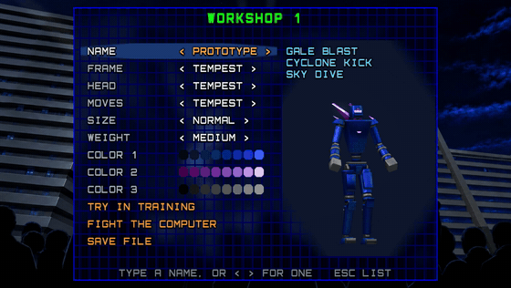
</p>

Build your own robot from the parts of the remaster's new robots: one's frame, another's head, a third one's special
moves, a size, a weight class and three colors. The game turns it into a full fighter on the spot, every sprite, move
and HD picture, ready for training or a fight. Robots are shared as small `.omfbot` files.

### Your own tournaments

Make a tournament of your own from the installed ones: fewer opponents, their robots as they were or the new ones,
more or less prize money. It shows up in **Tournament play** like the others, and is shared as a `.omftrn` file.

### The remaster's touches

<p align="center">
  
</p>

- **A painted main menu**: the robot on its stage in layers of painted parallax, under a spotlight, searchlights and
  camera flashes, the view leaning toward your mouse.
- **Two announcers**, Victor and Kristen, call the rounds, the knockouts and the winners, and after a fight a
  **newsreader** reads the TV report aloud, names and all.
- **Victory screens**: the winner, a line of theirs, and the fight in numbers.
- **A fight camera** (if you want it) that comes in close when the robots do.

<p align="center">
  
</p>

**And the credits are fought out.** Scored to [*Twenty Ninety-Seven (Remix)*](https://www.hadalstatic.com/releases/twenty-ninety-seven/)
by Hadal Static, a song about *One Must Fall 2097*: the 1994 logo is struck by lightning on the drop, then, on the
monitor of an old PC dressed in the game's colors, each credit pilots a robot in its own colors against something the
remaster had to beat (tech debt, spaghetti code, pixel noise, dead air) and wins, every final blow landing on the beat
and every winner's card flying onto the tower (**Play the credits** on the main menu, or **Extras › Credits**).

<p align="center">
  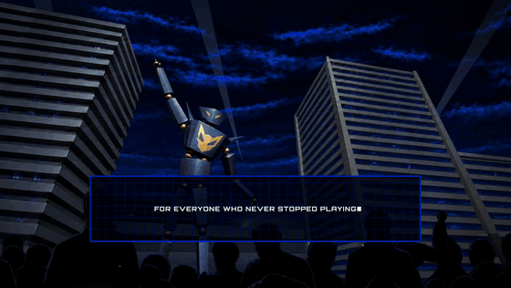
</p>
<p align="center">
  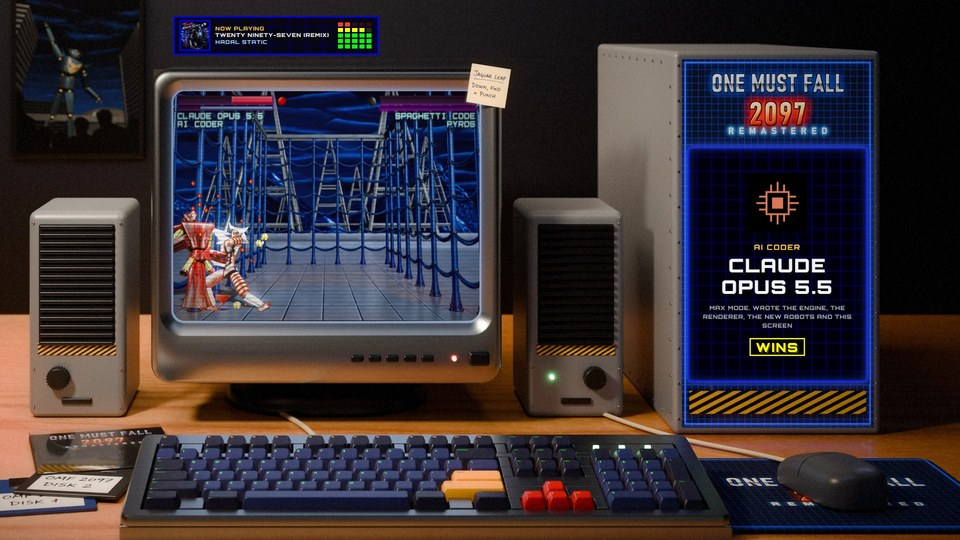
  
</p>

<details>
<summary><b>And more</b></summary>

<br>

- **Move lists** in the pause menu: every special move, throw and finishing move of both robots.
- **F1 help at any time**, with the game paused behind it.
- **Your own music**: drop songs onto the window, and they play in fights or everywhere.
- **Arena acoustics** (sounds echo like the stadium or the steel Danger Room) and an **impact bass** under heavy hits.
- **Achievements** announce themselves the moment they're earned.
- **Auto pause** when you switch to another window.
- **The German texts as written**, umlauts and all.

</details>

<br>

<a id="new-robots-and-arenas"></a>
<p align="center"><a href="#new-robots-and-arenas">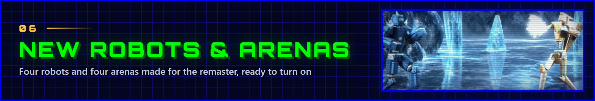</a></p>

Four robots and four arenas were made for the remaster, in the spirit of the originals. They are not part of the 1994
game, which stays as it was: they come with it as a mod, **off** until you turn on *New robots and arenas* in
**Extras › Mods** (or on the first start's setup screen).

<p align="center">
  
</p>

| Robot | Style | Special moves |
| --- | --- | --- |
| **GLACIER** | A heavy ice juggernaut: slow, strong, tough | **Ice Lance** ↓↘︎→ P, **Glacial Ram** ↓↙︎← K, **Frost Spikes** ↓↘︎→ K |
| **TEMPEST** | A light, fast wind robot with high, floating jumps | **Gale Blast** ↓↙︎← P, **Cyclone Kick** ↓↘︎→ K, **Sky Dive** ↓ K in the air |
| **HELIX** | An industrial driller with a spiral drill and a claw | **Drill Rush** ↓↘︎→ P, **Corkscrew** →↓↘︎ P, **Drill Bit** ↓↙︎← P |
| **SPECTRE** | A phantom with forearm lasers and a cloak of blades | **Photon Beam** ↓↘︎→ P, **Phase Shift** ↓↙︎← K, **Shadow Strike** ↓↘︎→ K |

They play like the originals: the full set of moves, a throw, a scrap and a destruction finisher, the player's three
colors, and a computer that knows how to fight with them. With the mod on, they join the robot select screen (a third
row), the computer's opponents and the robots Plug trades in tournaments.

<p align="center">
  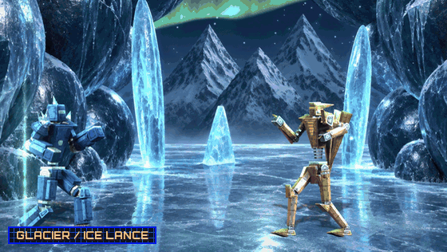
</p>

<p align="center">
  
</p>

- **Orbital**: a space station's hangar with the Earth in its window. Dust floats in the low gravity, and now and then
  a shuttle passes outside.
- **Ice Cave**: a frozen cavern under the aurora. Snow blows in, frost mist creeps over the ice, shooting stars fall
  over the mountains.
- **Rooftop**: a skyscraper's roof in the rain above a neon city. Lightning flashes over the skyline as a hover-car
  cruises by.
- **Abyss**: a glass dome on the sea floor. Bubbles rise, light ripples over the floor, a submersible glides past.

<p align="center">
  
</p>

The robots and arenas are 3D models ([`src/gen`](src/gen)), rendered into the game's own formats. The robots' HD frames
are rendered in Blender from the same models ([how](docs/BLENDER_SPRITES.md)), and the arenas' HD backgrounds were
painted over their renders by an image generation model. All four arenas are true widescreen, with their own music,
acoustics and moving scenery.

<br>

<a id="mods"></a>
<p align="center"><a href="#mods">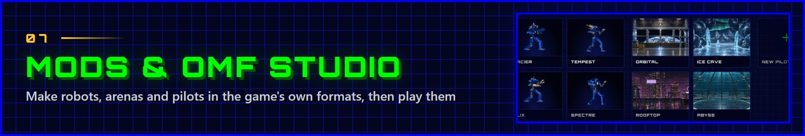</a></p>

**Mods** add robots, arenas and pilots that play exactly like the game's own: every animation, move and hit point, in
both looks, in every mode and in replays. Drop a `.omfmod` file onto the game to install it, and turn it on or off in
**Extras › Mods**.

**OMF Studio** makes them. It opens from **Extras › OMF Studio** (the installer can add its own shortcut too), and it
works in the game's own formats, pixel for pixel. The new robots and arenas are a mod too: open them in OMF Studio to
see how every animation, move and HD picture is put together.

<p align="center">
  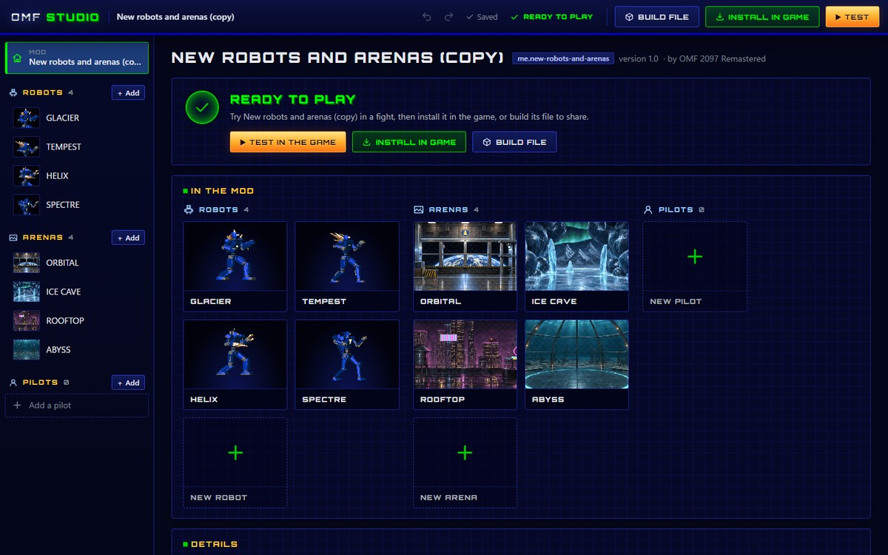
</p>

- **Robots**: start from a copy of any robot, the workshop's parts, or a blank figure. Draw every frame in the game's
  palette, place the hit points, and set each move's input, damage and the victim's reaction.
- **Arenas**: start from a copy or a picture, then add hazards, scenery and music.
- **Pilots**: portraits, lines, a personality for the computer to fight with, and an ending.
- **HD artwork** for the remastered look: templates to paint over, or pictures rendered from a robot's 3D model.
- **Test** it in the game right from Studio: a fight, the computer against itself, training or the one-player game.
  Then **install** it, or **build** the `.omfmod` file to share. Every change can be undone.

<p align="center">
  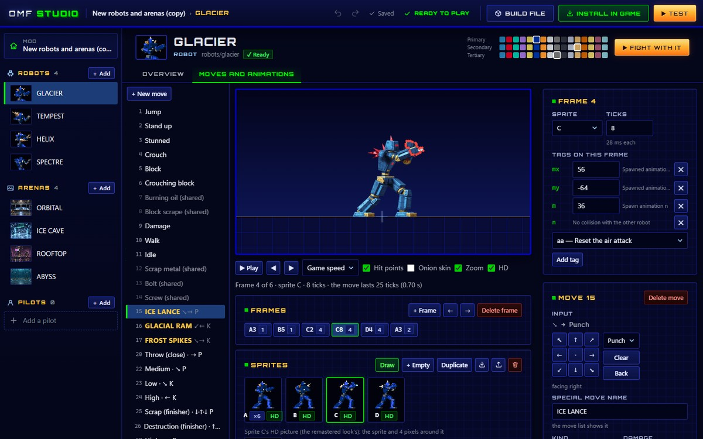
</p>

The mod format and every editor are explained in [docs/MODDING.md](docs/MODDING.md).

<br>

<a id="build"></a>
<p align="center"><a href="#build">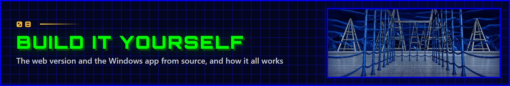</a></p>

The game data and the HD artwork come with the repository, so it takes a minute to get it running:

```sh
git clone https://github.com/Jared-woodruff/OMF-2097-Remastered.git
cd OMF-2097-Remastered
npm install && npm run dev        # then open http://localhost:5173
```

| Command | What you get |
| --- | --- |
| `npm run build` | The web version in `dist/`: a static site that works from any folder and offline after the first visit |
| `npm run desktop:build` | The Windows app: the portable exe and the installer |
| `npm test` | The test suite: the real game logic, run headless against the original data |
| `npm run manual` | The game manual, as a PDF |

[docs/BUILDING.md](docs/BUILDING.md) has the prerequisites, every other command (a lean web build, your own copy of the
game data, the HD artwork pipeline) and how the remaster's own content is made.

### Under the hood

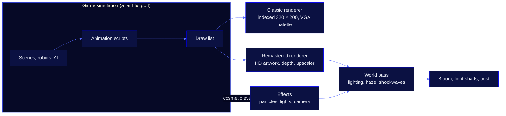

| Part | Built with |
| --- | --- |
| Language and build | TypeScript 7, Vite 8 |
| Graphics | WebGL2: the classic VGA pipeline, HD reconstruction, particles, lighting and post-processing |
| Sound | Web Audio, an AudioWorklet mixer and a port of the game's MASI music driver |
| Windows app | Tauri 2 (WebView2) |
| Tests | Vitest: 350 tests that run the game itself, headless, against the original data |

- **The HD artwork** is matched to the game's pictures by a fingerprint of their pixels, so the game's code doesn't
  know it's there, and each HD pixel follows its original's palette: player colors, fades and flashes work as in 1994.
  It loads per scene, as the game needs it.
- **It keeps up**: the remastered renderer watches its GPU time and lowers its internal resolution when a GPU can't.
  With every effect on, a frame takes about 8 ms on an RTX 4080 at 1920 × 1200.
- [docs/ARCHITECTURE.md](docs/ARCHITECTURE.md) explains how the code is organized and how it maps to the original's
  C reference. Want to help? Start with [CONTRIBUTING.md](CONTRIBUTING.md).

<br>

<a id="credits"></a>
<p align="center"><a href="#credits"></a></p>

- **The remaster**: [Jared Woodruff](https://github.com/Jared-woodruff) (human coder), Claude Opus 5.5 in Max Mode
  (AI coder), and OpenAI GPT6-ASTRA in Ultra Mode (the HD artwork).
- **The credits' song**: [*Twenty Ninety-Seven (Remix)*](https://www.hadalstatic.com/releases/twenty-ninety-seven/) by
  Hadal Static, used with the artist's permission.
- ***One Must Fall 2097*** © 1994 Diversions Entertainment, published by Epic MegaGames, freeware since 1999. This is
  an unofficial fan project, not affiliated with or endorsed by its makers; all trademarks belong to their owners.
- **[OpenOMF](https://github.com/omf2097/openomf)** (MIT): the open-source reimplementation whose reverse engineering
  this port follows.
- **The announcers' voices**: Victor and Kristen from the [ElevenLabs](https://elevenlabs.io) voice library, performed
  with Eleven v4 and finished with FFmpeg.
- **Also built with**: Hyllian's xBR-lv2 shader (MIT), the [Orbitron](https://github.com/theleagueof/orbitron) typeface
  by Matt McInerney ([SIL OFL 1.1](public/fonts/Orbitron-OFL.txt)), [Tauri](https://tauri.app), Vite, TypeScript and
  Vitest.

The source code is released under the [MIT license](LICENSE). The original game's files and the artwork made from them
are included on the game's freeware terms instead: **free of charge, never sold**. See [NOTICE.md](NOTICE.md).

<p align="center">
  
</p>
