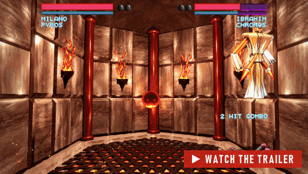
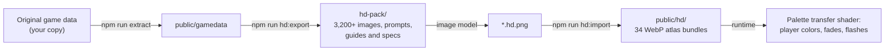
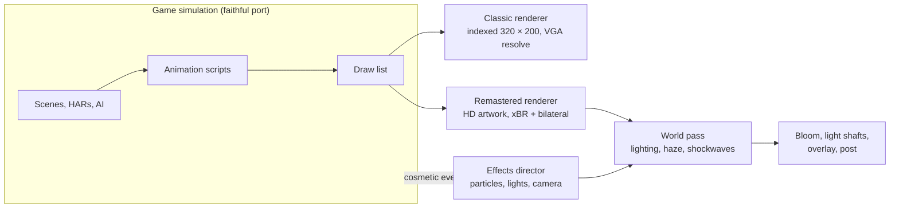

<p align="center">
  
</p>

<p align="center">
  
  
  
  
  
</p>

<p align="center">
  <a href="#trailer"><b>Trailer</b></a> &nbsp;•&nbsp;
  <a href="#features"><b>Features</b></a> &nbsp;•&nbsp;
  <a href="#classic-remastered"><b>Classic / Remastered</b></a> &nbsp;•&nbsp;
  <a href="#effects"><b>Effects</b></a> &nbsp;•&nbsp;
  <a href="#gameplay"><b>Gameplay</b></a> &nbsp;•&nbsp;
  <a href="#screens"><b>Screens</b></a> &nbsp;•&nbsp;
  <a href="#artwork"><b>HD artwork</b></a> &nbsp;•&nbsp;
  <a href="#get-started"><b>Get started</b></a> &nbsp;•&nbsp;
  <a href="#under-the-hood"><b>Under the hood</b></a> &nbsp;•&nbsp;
  <a href="#credits"><b>Credits</b></a>
</p>

<br>

<a id="trailer"></a>
<p align="center">
  <a href="docs/media/trailer.mp4"></a>
  <br>
  <sub>▶ <a href="docs/media/trailer.mp4"><b>Watch the trailer</b></a>: 52 seconds, 1080p60, scored with the original <i>One Must Fall</i> menu theme played by this port's music engine.</sub>
</p>

<br>

**One Must Fall 2097** (Diversions Entertainment, 1994) is the robot fighting game that turned a generation of DOS
players into pilots of 90-foot war machines. This project rebuilds it for today: a faithful reimplementation of the
engine in TypeScript and WebGL2 that plays the **original game data**, runs in any modern browser and as a native
**Windows app**, and lets you flip between the **pixel-exact 1994 look** and a **remastered HD version** at any moment.

<table>
  <tr>
    <td width="33%" valign="top">
      <h3>🎯 Faithful</h3>
      Fight engine, AI, animation scripts, scenes and menus follow the reverse engineering of the
      <a href="https://github.com/omf2097/openomf">OpenOMF</a> project, quirks included. The soundtrack plays through an
      exact port of the game's own MASI music driver.
    </td>
    <td width="33%" valign="top">
      <h3>💎 Remastered</h3>
      3,200+ images redrawn in HD, every sprite rebuilt at your display resolution, widescreen arenas, dynamic
      lighting, particles, bloom and smooth motion for high refresh rate displays.
    </td>
    <td width="33%" valign="top">
      <h3>🕹️ Modern</h3>
      Any window size up to 4K and beyond, fullscreen, gamepads with rumble, mouse in every menu, rebindable keys,
      training mode, F1 help and saves that just work.
    </td>
  </tr>
</table>

<br>

<a id="features"></a>
<p align="center"><a href="#features"></a></p>

The whole game is here, playing the original data files:

- **All 11 robots** (HARs) with every move, special and throw, **10 pilots plus Major Kreissack**, and the CPU
  opponent's personalities and difficulty levels.
- **The five arenas and their hazards**: the Stadium, the spiked Danger Room, the Power Plant's electrified fences,
  the Fire Pit's fireballs and the Desert's strafing jets.
- **Every mode**: one player, two players, demo, the full **tournament** career with the mechlab, upgrades, training
  and newsroom, the scoreboard, the intro and all endings.
- **The original music and sound**: the PSM soundtrack through a port of the MASI driver, the original samples, and
  an optional high quality resampler.

<p align="center">
  
</p>

<br>

<a id="classic-remastered"></a>
<p align="center"><a href="#classic-remastered"></a></p>

<p align="center">
  
  <br>
  <sub>The same moment in both renderers. <b>F2</b> switches between them at any time, even mid-fight.</sub>
</p>

<table>
  <tr>
    <th width="50%">Classic</th>
    <th width="50%">Remastered</th>
  </tr>
  <tr>
    <td valign="top">
      <ul>
        <li>The original VGA pipeline on the GPU: sprites composited as palette indices into a 320 × 200 framebuffer,
          then resolved through the palette and all 19 remap tables exactly like 1994.</li>
        <li>Sharp pixels, smooth scaling or a CRT scanline filter.</li>
        <li>Optional widescreen for fights.</li>
      </ul>
    </td>
    <td valign="top">
      <ul>
        <li>HD artwork for backgrounds, robots, portraits and effects, or a procedural upscaler (xBR edges plus
          bilateral shading) for anything without it.</li>
        <li>Palette effects still work: player colors, fades, flashes and tints are mapped onto the HD pixels live.</li>
        <li>Widescreen arenas, ambient fill for menus, smooth motion between game ticks, bloom and dynamic resolution.</li>
      </ul>
    </td>
  </tr>
</table>

<br>

<a id="effects"></a>
<p align="center"><a href="#effects"></a></p>

Remastered fights get a layer of modern effects, driven by what actually happens in the fight:

<table>
  <tr>
    <td width="50%" valign="top">
      
      <br><b>Fire Pit</b>: rising embers, torchlight on the robots and heat haze over the grate.
    </td>
    <td width="50%" valign="top">
      
      <br><b>The Desert</b>: backlight from the sunset, sun shafts and sand blowing over the dunes.
    </td>
  </tr>
  <tr>
    <td width="50%" valign="top">
      
      <br><b>Power Plant</b>: the electrified fences throw blue light across the whole arena.
    </td>
    <td width="50%" valign="top">
      
      <br><b>Knockouts</b>: a flash, a shockwave, a burst of sparks and a slow-motion zoom on the final blow.
    </td>
  </tr>
</table>

| Group | What it adds |
| --- | --- |
| **Particles** | Sparks and impact flares on hits and blocks, dust from falls, throws and wall slams. |
| **Lighting** | Impacts, fire, energy and projectiles light up the arena and the robots; each arena lights the robots' edges. |
| **Impact FX** | Shockwaves on heavy hits, and the knockout camera with flash and chromatic aberration. |
| **Atmosphere** | Embers and heat haze, blowing sand, drifting dust, floodlight glow and camera flashes in the crowd. |

> [!NOTE]
> The effects are purely cosmetic. They never touch the game state or its random number generators, so a fight
> plays out exactly the same with them on or off, and a test checks that. Each group can be switched off in
> **Configuration › Video › Remastered options**.

<br>

<a id="gameplay"></a>
<p align="center"><a href="#gameplay"></a></p>

<p align="center">
  
</p>

- **Training mode** (main menu, where network play used to be): pick your robot, pilot, opponent and arena, then
  practice against a dummy that stands, crouches, jumps, blocks high or low, or fights back. Nobody gets knocked out,
  health refills after every combo, and a readout shows the last hit and combo damage.
- **The advanced options the original promised**: *Defensive throws*, *Knock down* and *Block damage* were listed in
  the 1994 menus but never implemented by OpenOMF. They now work as the original help text describes.
- **Gamepad rumble** on hits, blocks, throws, wall slams and knockouts.
- **Mouse support** in every menu: hover to select, click to activate, scroll to change values, right click to go back.
- **F1 help at any time**, as the original help pages promised, with the game paused behind it.

<br>

<a id="screens"></a>
<p align="center"><a href="#screens"></a></p>

<p align="center">
  
  
</p>
<p align="center">
  
  
</p>
<p align="center">
  
  
</p>

Every menu and text of the game was audited: a layout test checks that each entry fits its frame and each help text
fits its panel, and a text audit reports anything cut off or drawn off screen in every scene the tests visit.
Dialogs grow to fit their message, and the remastered font can be smooth or crisp pixels.

<br>

<a id="artwork"></a>
<p align="center"><a href="#artwork"></a></p>

The HD artwork was produced with an image generation model from the original images, then imported into texture
atlases the game loads on demand:



- **No game code changes needed**: surfaces are matched to their artwork by a fingerprint of their palette indices.
- **Live colors**: each HD pixel is mapped through the palette change of the original pixel it belongs to, so the
  artwork follows player color choices, fades, flashes and tints exactly like the original sprites.
- **Streaming**: bundles per scene, robot and shared effects load on demand, and scene changes preload the next ones.

The pack and the imported artwork contain images of the original game, so neither is part of this repository. See
[docs/BUILDING.md](docs/BUILDING.md) to create and import your own.

<br>

<a id="get-started"></a>
<p align="center"><a href="#get-started"></a></p>

> [!IMPORTANT]
> The game data is not included. *One Must Fall 2097* has been freeware since 1999: put the CD contents in `omf21cd/`
> (the installer is `omf21cd/OMF/OMF21.EXE`) or point `npm run extract` at your copy.

```sh
git clone https://github.com/Jared-woodruff/OMF-2097-Remastered.git
cd OMF-2097-Remastered
npm install
npm run extract                  # or: npm run extract -- path/to/OMF21.EXE
npm run dev                      # play at http://localhost:5173
```

| Command | Result |
| --- | --- |
| `npm run build` | The web version in `dist/`: a static site you can host anywhere, even in a subfolder. |
| `npm run desktop:build` | The Windows app: a portable `omf2097-remastered.exe` and an installer under `src-tauri/target/release/`. |
| `npm test` | The test suite (headless, against your game data). |

Prerequisites and details for every platform are in [docs/BUILDING.md](docs/BUILDING.md).

### Controls

| | Player 1 | Player 2 |
| --- | --- | --- |
| Move / jump / duck | Arrow keys, Home / PgUp / End / PgDn for diagonals (or the numpad) | Q W E / A D / Z X C |
| Punch | Enter | Left Ctrl or F |
| Kick | Right Shift | Left Shift or G |

<kbd>Esc</kbd> pause menu &nbsp;·&nbsp; <kbd>F1</kbd> help &nbsp;·&nbsp; <kbd>F2</kbd> classic / remastered &nbsp;·&nbsp;
<kbd>F11</kbd> or <kbd>Alt</kbd>+<kbd>Enter</kbd> fullscreen. Keys can be rebound in **Configuration › Input**, and
gamepads work out of the box.

<br>

<a id="under-the-hood"></a>
<p align="center"><a href="#under-the-hood"></a></p>



| Layer | Technology |
| --- | --- |
| Language and build | TypeScript 7, Vite 8 |
| Rendering | WebGL2: classic VGA pipeline, HD reconstruction, particle, lighting and post-processing passes |
| Audio | Web Audio with an AudioWorklet mixer and a port of the MASI PSM music driver |
| Desktop | Tauri 2 (WebView2), a portable exe and an installer |
| Tests | Vitest, 155 tests running the real game logic headlessly against the original data |

- The remastered renderer measures its GPU time and lowers its internal resolution when a GPU can't keep up. With
  every effect on, a frame takes about 8 ms of GPU time at 1920 × 1200 on an RTX 4080.
- [docs/ARCHITECTURE.md](docs/ARCHITECTURE.md) explains how the code is organized and how the C reference maps to it.
- `?fight=3&ai` in the dev server's URL starts a CPU fight in the Fire Pit; `window.__omf` exposes a debug API for
  stepping, input and captures.

<br>

<a id="credits"></a>
<p align="center"><a href="#credits"></a></p>

- ***One Must Fall 2097*** © 1994 Diversions Entertainment, published by Epic MegaGames, freeware since 1999. All
  trademarks belong to their owners. This is an unofficial fan project, not affiliated with or endorsed by the
  original authors.
- **[OpenOMF](https://github.com/omf2097/openomf)** (MIT license): the open-source reimplementation whose reverse
  engineering this port follows.
- **Hyllian's xBR-lv2 shader** (MIT license): adapted for the remastered sprite reconstruction.
- The app icon is made from the original game's icon, and the HD artwork was generated from the original images.

The source code in this repository is released under the [MIT license](LICENSE). It contains no game data or artwork
of the original game; the screenshots and videos in `docs/media` show the game running with it.

<br>

<p align="center">
  
</p>
