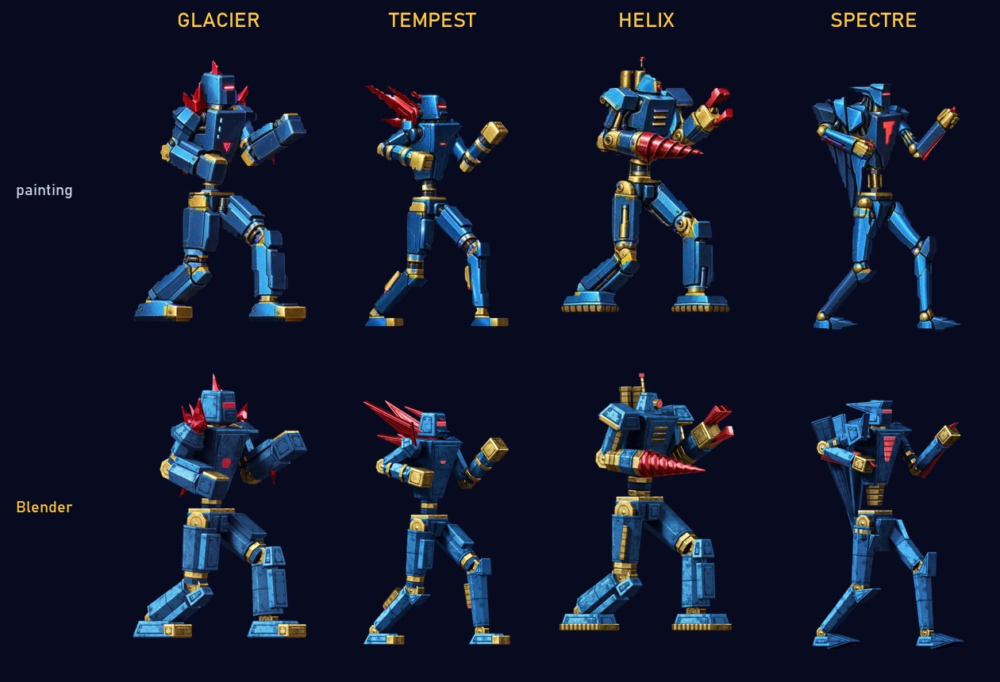
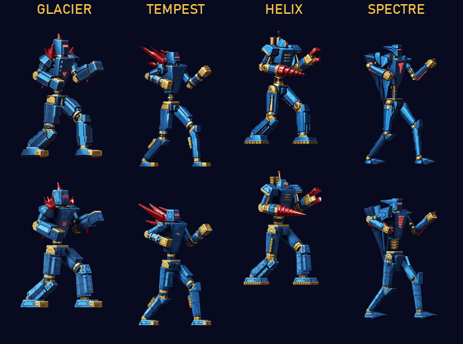

# Blender sprites: the new robots' HD frames rendered from their 3D models

The new robots' HD frames used to be painted one by one by an image model, so the same part came out differently
from frame to frame and the armor flickered in the game (`npm run rework:survey` measures it). The new robots are 3D
models already (`src/gen`), so their frames are now rendered in Blender instead: every frame shows the same plates,
bolts and wear, lit the same way, in the paintings' colors. The pictures of GLACIER, TEMPEST, HELIX and SPECTRE in the
mod that comes with the game (`public/mods/omf2097r.extras.omfmod`) are these renderings: every sprite (fights,
projectiles and effects, the robot select cell, the VS picture) and the mech lab's turning robot.

<p align="center"></p>

## Making them

```sh
npm run blender:export -- HELIX                  # .captures/blender/helix.glb, and helix/sprites/*.png
npm run blender:render -- HELIX                  # .captures/blender/helix/hd: every sprite's HD picture and zone mask
npm run extras -- --blender .captures/blender    # the pictures into the mod's package, for every robot rendered there
```

`blender:render` exports the robot first when there is no export yet (export again whenever `src/gen` changes), runs
Blender 5.2 headless (`BLENDER=` its path when it is not in the default place) and grades the pictures with Python 3
(numpy and Pillow; `PYTHON=` to choose one). `--frames m11s0,m61s0` or `--moves 11,10` render part of a robot,
`--scale 3` at three times the size. On an RTX 4080 (OptiX), a robot's 170 to 180 frames and their masks take about
two minutes, after a one-time kernel compile of about 80 seconds; two robots can render side by side. The builder
makes the pictures WebP on every core (about two minutes for all four robots).

The builder takes every sprite's picture from `<folder>/<robot>/hd/m<move>s<sprite>.png` and checks it: the export's
copy of each sprite must be the fighter file's, pixel for pixel (a menu picture's background aside: its HD picture
leaves it see-through, like the paintings did), and each picture the size of its sprite's frame. The mech lab's
turning robot (`mech0.png` to `mech19.png`) goes in `hd.json`'s `mech`, by the fingerprints of the frames the game
draws (`turntable` in `src/gen/mechlabModel.ts`, which the export uses too); the game renders those frames itself
only for a robot without them. A robot without a folder there keeps the pictures it had.

## How it works

- **Export** (`tools/blender/`, run through Vitest; nothing of it is in the game's bundle). `sceneGltf.ts` writes
  every sprite of the robot as a scene of objects: each shape the game draws is an object of its own, the same object
  in every sprite it appears in (a robot part is `joint.index`, an attachment `joint+part`, a projectile's or an
  effect's piece `prop|shape|material|n`), its mesh in the shape's own space (`tessellate.ts`: prisms keep their
  flat faces, rounded boxes and blades their exact rounded edges) and keyframed into place for each sprite (STEP; a
  scale of 0 keeps it out of a sprite). The scene's extras give each frame's rectangle and kind (pose, effect, menu
  picture, whose pixels are a magnified view), the palette's color ramps, the HD scale and margin. `export.test.ts`
  checks the meshes against the game's distance functions, the skeleton against `jointTransforms`, and every
  sprite's objects against the shapes the game places; the export also writes each sprite as the game draws it. After
  the fighter file's sprites come the mech lab's twenty frames (`mech0`..`mech19`: the presentation pose turned,
  magnified to the original robots' size).
- **Render** (`render_frames.py`). Per frame, an orthographic camera on the sprite's rectangle plus the 4-pixel margin
  at 5 × 6 HD pixels per sprite pixel, so every picture lies exactly over its sprite. The key light comes from the
  upper left like the game's, but more from the side, like the paintings' (the faces turned to the viewer stay a deep
  shade, the edges and tops facing the light catch it), with a weak fill, a rim from behind and a studio of softboxes
  for the shiny surfaces to reflect. Armor is glossy paint (its reflections in its own color, none on faces seen
  edge-on, which would grey whole side panels), joints are brass, accents lacquered, the robots' own lights deep in
  their color with a bright core.
- **Detail** (`detail.py`), built into each part's material in the part's own coordinates, so it is the same in every
  frame and nothing swims: plates standing proud of inset seams, panel divisions, bolts in their sockets, machined
  rings and caps on the joints, borders and spines on blades; worn paint (mottling, grime, chips that gather on the
  edges, flecks, scratches) and metal with uneven polish, tarnish and fine scratches. Each robot has its own:
  - HELIX: a smooth drill with two spiral flutes in place of the six faceted sections (it follows the hand), tread
    soles, spiral drill bits for its projectile;
  - GLACIER: ice crystals and ice (projectile, spikes, shards) glossy and faceted like clusters of shards, with frost
    veins and a little light inside;
  - TEMPEST: a turbine fan in its chest intake, its wind blades in streaks of light;
  - SPECTRE: its chest emblem lit in bars;
  - the effects' energy (beams, flashes) white-hot in the middle and restless.
- **Zone masks** (a second pass): every material becomes a flat emission, R = secondary (red zone), G = tertiary
  (gold), B = primary (blue), linear, so the channels are each zone's coverage; effect colors have alpha only.
  `zone_masks.py` does the same pass over a saved scene.
- **Grade** (`grade.py`, which `blender:render` runs). Each zone's brightness goes through a tone curve that gives
  the renderings the paintings' distribution of shades, and each shade takes the paintings' average color at that
  brightness (brass browner in the shadows and paler in the highlights, red deep, blue toward indigo in the dark).
  The curves and colors are each robot's look, `tools/blender/looks/<robot>.json`, measured once from its paintings
  (`grade.py --calibrate <package>`: the frames both cover, the pixels the mask gives wholly to a zone). It is one
  mapping per zone for all of a robot's frames, so nothing flickers, and the colors stay those of the zone, which the
  game recolors in the player's colors (`src/video/hd/artShaders.ts` maps every HD pixel through the sprite pixel
  whose color it matches). Without a look, a zone's shades take its palette ramp's colors. Effects keep their
  rendered colors; the menu pictures are cut to their frame like their sprites. The rendering stays beside each
  picture as `<name>.raw.png`, so grading again needs no rendering.

The looks were measured from the robots' paintings (the mod's HD pictures before the renderings replaced them) and are
kept in `tools/blender/looks`. To measure them again, build a package with the paintings (from the folder of their
painted `fighter-GLACIER`... bundles, not from a package that already has the renderings) and calibrate from it:

```sh
npm run extras -- --hd <painted bundles> --out .captures/paintings
python tools/blender/grade.py --glb .captures/blender/helix.glb --renders .captures/blender/helix/hd --calibrate .captures/paintings/omf2097r.extras.omfmod
```

<p align="center"></p>

## Scores

`score.py` puts the renderings and the paintings of the same jobs through the HD packs' checks:
`tools/rework/survey.py` (how much each frame's detail differs from the next ones' beyond what the sprites differ)
and `tools/hd-pack/validate.py` (silhouette, colors, color zones against the sprites), and compares the masks with
the sprites' zones. Render a robot with the new-art pack's job names first:

```sh
npm run blender:render -- HELIX --pack newart-pack --out .captures/blender/helix/pack
python tools/blender/score.py --robot HELIX --renders .captures/blender/helix/pack --out .captures/blender/score-helix
```

| Blender (paintings) | GLACIER | TEMPEST | HELIX | SPECTRE |
| --- | ---: | ---: | ---: | ---: |
| Frames | 138 | 132 | 135 | 131 |
| Inconsistency (0 = the same detail; the best original robot: 0.039) | **−0.064** (0.091) | **−0.060** (0.117) | **−0.053** (0.173) | **−0.053** (0.165) |
| Silhouette IoU with the sprite (median) | **0.994** (0.983) | **0.991** (0.973) | **0.987** (0.976) | **0.990** (0.949) |
| Drawn outside the sprite / holes | 0 / 0 (0 / 0) | 0 / 0 (0 / 0.001) | 0 / 0 (0 / 0.001) | 0 / 0 (0 / 0.009) |
| Brightness | 81.2 (80.7) | 82.5 (82.0) | 82.3 (80.7) | 72.0 (71.4) |
| Color difference from the sprite (0–255, median) | 34.6 (**26.1**) | 35.6 (**30.5**) | 39.0 (**35.9**) | 36.8 (**33.7**) |
| Color zones kept (median) | 0.968 (**0.988**) | 0.969 (**0.984**) | 0.970 (**0.994**) | 0.937 (**0.996**) |
| Zone masks agreeing with the sprites' zones | 98.7 % | 98.7 % | 97.8 % | 98.8 % |

- **Consistency is solved by construction.** The renderings score below zero: they differ less from frame to frame
  than the dithered sprites do. The paintings of the same frames score 0.09 to 0.17.
- **Placement and zones are exact.** The poses, rectangles and silhouettes are the game's own; the masks agree with
  the sprites on about 98 % of the zone pixels (the rest are dithered and edge pixels, and the projectiles' effect
  colors that happen to look like a zone's).
- **Relit, not traced.** The renderings are lit again rather than following the sprites' own shading, so their colors
  differ more from the sprites' (the paintings were traced over them), and thin parts in shadow (SPECTRE's skeletal
  joints) leave their zone's hue more often in the check's scaled-down comparison. Neither matters to the
  recoloring, which works from each HD pixel's own color.

## Notes

- The original robots have no 3D models of their own (their sprites were rendered in 1994 from models that are lost).
  `npm run blender:originals` is a starting point: JAGUAR modeled from its sprites
  (`tools/blender/originals/models/jaguar.ts`), its pose in every sprite fitted (`fit.ts`: silhouette, color zones and
  the gold joints), the model refined against the fits, and an export for `blender:render` (`grade.py` takes the
  look from the paintings and fills from them what the fitted model leaves uncovered). Its renderings are not yet as
  good as the paintings: fitting the poses to small sprites is the hard part (overlapping parts, turns). The other
  ten would each need a model made the same way.
- Blender's glTF importer adds a hidden "Icosphere" object as an armature's bone shape. Tools that frame the camera on
  every imported mesh must import with `disable_bone_shape=True`, as `render_frames.py` does, or leave that object
  out.
