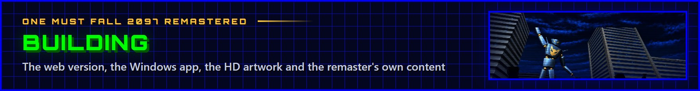

<p align="center"></p>

## Prerequisites

- **Node.js 22.12+** (developed on Node 24) and npm.
- **The original game's data** comes with the repository (`public/gamedata/`; *One Must Fall 2097* is freeware, see
  [NOTICE.md](../NOTICE.md)), and so does the imported HD artwork (`public/hd/`).
- **Desktop build only (Windows):**
  - Rust stable with the MSVC toolchain (`x86_64-pc-windows-msvc`), via [rustup](https://rustup.rs).
  - Visual Studio 2022 Build Tools with the "Desktop development with C++" workload (MSVC linker and Windows SDK).
  - The Microsoft Edge WebView2 runtime. It comes with Windows 11 and current Windows 10.
  - Network access for the first build. Cargo downloads crates, and the Tauri CLI downloads NSIS.

  See the [Tauri prerequisites](https://v2.tauri.app/start/prerequisites/) for details.

## Setup

```sh
npm install
```

To use the data of another copy of the game instead (the CD's `OMF/OMF21.EXE`, a PKZIP self-extractor, or an
installed copy):

```sh
npm run extract                       # reads omf21cd/OMF/OMF21.EXE (falls back to gamedata/)
npm run extract -- path/to/OMF21.EXE  # or pass OMF21.EXE, a .zip, or an installed game directory
```

`extract` replaces the files in `public/gamedata/` with that copy's.

### HD artwork

The imported artwork in `public/hd/` comes with the repository. To replace it with a new HD asset pack (see the
README):

```sh
npm run hd:export                     # writes the pack for the image model to hd-pack/ (sources, guides, prompts, specs)
npm run hd:export -- path/to/folder   # or to another folder
npm run hd:import                     # reads hd-pack/, writes public/hd/ (needs Python 3 with numpy and Pillow)
npm run hd:import -- path/to/pack     # or another pack folder
```

The export empties its folder first, so it stops when the folder holds delivered `*.hd.png` files (they are not in
git): export to another folder, or add `-- --force` to delete them. `npm run newart:export` (below) does the same.

The web and desktop builds include `public/hd/` when it exists; without it, the remastered mode upscales the
original images procedurally.

### The main menu's layers

In remastered mode the main menu is a parallax scene of painted layers (`public/hd/menu/`, drawn by
`src/video/stage/parallax.ts`). `npm run menu:export` writes a small pack for an image generation model to
`menu-pack/`: a master image of the whole scene and the layers cut from it (sky, city, the two towers, the robot and
the robot in the spotlight, two rows of crowd), each with a guide, a mask, a context image and a prompt (the pack's
README and OUTPUT_SPEC explain the rest). Once the model has made the `*.hd.png` files:

```sh
npm run menu:import                   # reads menu-pack/, writes public/hd/menu/ (Python 3 with numpy and Pillow)
```

Layers the pack does not have yet come from placeholders cut from the current HD artwork (made by `menu:export`).

### Generated content: the new robots and arenas

The new robots and arenas are generated from `src/gen` and come with the game as a mod: its package,
`public/mods/omf2097r.extras.omfmod`, and the list of the mods that come with the game, `public/mods/index.json` (both
committed, so a fresh checkout does not need this). After changing their definitions:

```sh
npm run gen                           # robots (FIGHTR11-14.AF) and arenas (ARENA5-8.BK/.WID), then into the package
SKIP_ARENAS=1 npm run gen             # only the robots (ROBOT=glacier for one); SKIP_ROBOTS=1 / ARENA=ORBITAL,ARENA7 likewise
npm run gen -- some/folder            # only the files, into that folder (the package stays as it is)
```

The arenas need the game data (`public/gamedata`). `npm run gen` makes the files in a work folder and runs
`npm run extras`, which packs the mod: what it is not given is kept from the package already there, and the same
inputs give the same package, byte for byte. Its options, for the other steps below:

```sh
npm run extras -- --gen <folder>      # the fighter and scene files of that folder (npm run gen's)
npm run extras -- --hd <folder>       # the robots' HD pictures, cut out of the fighter-GLACIER... bundles of an HD asset folder
npm run extras -- --arena-hd <folder> # the arenas' HD backgrounds (ARENAn-WIDE.webp, 2880 x 1200)
npm run extras -- --out <folder>      # somewhere else than public/mods
```

A robot's HD picture goes with the fingerprint of its sprite: a sprite that changed loses its picture, and the game
renders that one from the robot's 3D model instead, on the GPU while it runs. The arenas' HD backgrounds are rendered
on the GPU in the browser: start `npm run dev`, open http://localhost:5173/?genarenahd (or `?genarenahd=ARENA6.BK`
for one arena), wait for "done", then run `npm run gen:hd` (Python 3 with Pillow) to put `.captures/ARENAn-WIDE.png`
in the package (arenas painted by an image model, see below, keep their paintings unless `-- --force`).

### The new robots' and arenas' artwork

The generator's robots and arenas are plainer than the originals' HD artwork. `npm run newart:export` writes a pack for
an image generation model to `newart-pack/` (and `newart-pack.zip`): each arena as one widescreen painting to redo
(2880 × 1200, with the current painting as its guide and a layout image of the lines to keep: the floor, the fighting
area, the 4:3 screen), and each robot as a design sheet (its fighting stance, to settle its detailed look) followed by
every frame of its animations, redrawn from it. Reference sheets set the originals' HD artwork (from `hd-pack/`) next
to the new content as the game shows it now; the pack's README, OUTPUT_SPEC and STYLE_GUIDE explain the rest. Once the
model has made the `*.hd.png` files:

```sh
npm run newart:import                 # reads newart-pack/ (Python 3 with numpy and Pillow)
npm run newart:import -- path/to/pack # or another pack folder
```

An arena's painting becomes its HD background and, at the native 576 × 200, `src/gen/scene/art/ARENAn.png`, which
`npm run gen` indexes in place of the rendering: the classic graphics, and the colors the painting is recolored
through. The robots' frames are clipped to their silhouettes, get a steel core drawn in behind them through the waist
(where a sprite's spine rings part in a leaning pose, the painting showed the torso floating over the hips;
`src/gen/dev/spineCore.test.ts` renders the core), are copied into `hd-pack/` (their jobs added to its `jobs.jsonl`)
and made into HD bundles with the originals' artwork's importer. The import runs all of it and puts the results in
the mod's package (`npm run extras`); `public/hd/` is not touched. A later full `npm run hd:import` makes the new
robots' bundles too: it puts them in the package the same way and takes them back out of `public/hd/`. Anything not
delivered keeps its current artwork; `newart-pack/import_report.txt` lists deliveries worth a look (no transparency,
drawn outside the silhouette, a moved composition).

The frames can also be rendered from the robots' 3D models in Blender (a proof of concept, see
[BLENDER_SPRITES.md](BLENDER_SPRITES.md)): `npm run blender:export` writes a robot as glTF (its mesh, skeleton and every
sprite's pose), `npm run blender:render` renders HD pictures and color zone masks from it (Blender 5.2; `BLENDER=` its
path when it is not in the default place), and `tools/blender/score.py` compares them with the current paintings.

### Other generated data

- **Combo trials** (`src/game/training/trialData.ts`, committed): `COMBO_SEARCH=1 npx vitest run
  src/gen/dev/comboSearch.test.ts` searches every robot's combos (about 15 minutes), then `COMBO_VERIFY=1 npx vitest run
  src/gen/dev/trialVerify.test.ts` checks them against every robot and writes the file.
- **Announcers** (`public/audio/announcer/male|female/*.mp3`, committed): `python tools/make-announcer.py` performs
  the lines with [ElevenLabs](https://elevenlabs.io) Eleven v4 (set `ELEVENLABS_API_KEY` to an API key with text to
  speech access; `--voice male`, `--takes N` or a list of lines to redo some): each line is directed with audio tags,
  generated in a few takes, the most intense one kept, and finished with ffmpeg. The round calls are kept under 1.2 s
  (the time before "Fight!"). Any line can be replaced by a recording of the same name.
- **Newsreader** (`public/audio/news/male|female/`, committed): `npm run news:voice` writes the recording plan
  (`src/gen/dev/newsPlan.ts`: the news texts in their pronoun versions with stand-in names, and every name in carrier
  sentences for the places it takes) and records it with ElevenLabs (`tools/make-news.py`, `ELEVENLABS_API_KEY`;
  `-- --voice female`, `--only t97` for some, `--force` to redo): the speech comes with character timestamps, so the
  texts are cut tight around the names and the names out of their carriers. Recordings already made are kept, so a run
  resumes. `-- --engine sapi --out DIR` tries the whole chain for free with Windows' speech synthesizer.
  `src/test/newsVoice.test.ts` checks that the plan covers every report with every name.

### The game manual

The manual (`docs/manual/OMF-2097-Remastered-Manual.pdf`, committed) is made from `tools/manual`: the game's own
texts, the pilots' stats and every robot's command list are read from the game data (the command lists as the pause
menu's move list shows them), laid out as the pages of a 1990s booklet and printed to PDF by Microsoft Edge in
headless mode (Windows).

```sh
npm run manual                        # docs/manual/OMF-2097-Remastered-Manual.pdf; reports pages whose content does not fit
npm run manual:images                 # the pictures in tools/manual/img (Python 3 with Pillow)
```

`npm run manual` only needs `tools/manual/img` (committed). The pictures are made from the HD asset pack (`hd-pack/`:
the robots, the pilots, the logo), the imported artwork (the main menu's layers, the arenas) and screenshots recorded
from the game (`.captures/trailer2`), so `manual:images` only runs when they change.

### The GitHub pages' pictures

The README's hero, buttons, section banners and footer, the docs' headers and the repository's social preview
(`docs/media`, committed) are HTML in the style of the game's menus (the blue grid panels in their bright blue frames,
the green and gold Orbitron, the painted main menu), made by `tools/github/build.mjs` from the game's own pictures and
shot by Microsoft Edge in headless mode (Windows):

```sh
npm run github                        # every picture
npm run github -- hero banner-tech    # only those (their file names)
npm run github -- --out some/folder   # somewhere else, to compare first
```

The social preview (`docs/media/social-preview.jpg`, 1280 × 640) is set in the repository's settings (General ›
Social preview): GitHub has no other way to set it.

## Web

| Command | What it does |
| --- | --- |
| `npm run dev` | Vite dev server on http://localhost:5173 (strict port). |
| `npm run build` | Typechecks (`tsc --noEmit`), then builds the static site into `dist/`. `npm run preview` serves it. |

The build uses relative URLs (`base: './'`), so `dist/` works from any path.

### Publishing the web version

`npm run build` makes the complete site: game data and artwork included, the game starts with one click. The
[Web version](../.github/workflows/pages.yml) workflow builds it and publishes it on GitHub Pages on every push to
`main`, once the site is turned on (repository settings: Pages from GitHub Actions, and the variable
`WEB_VERSION = on`).

### A lean web version

| Command | What it does |
| --- | --- |
| `npm run build:web` | `npm run build`, then reports the site's size (game data and artwork included). |
| `npm run build:web -- --lean` | The same, then removes `dist/gamedata/` and `dist/hd/` (0.5 MB). |

A lean site asks for the game on its first visit: players drop or pick the freeware `OMF21.EXE`, a zip
that contains the game or its installer, or the folder of an installed copy. `src/platform/gameData.ts` unpacks it in
the browser (the installer is a PKZIP self-extractor; deflate goes through `DecompressionStream`) and keeps the files
in IndexedDB, so later visits start right away. Nothing is uploaded. A service worker (`public/sw.js`) caches the
site for offline play, and `public/manifest.webmanifest` makes it installable. Serve it over HTTPS (or localhost):
browsers only run service workers there.

## Desktop (Tauri 2, Windows)

| Command | What it does |
| --- | --- |
| `npm run desktop:dev` | Runs `npm run dev` and opens the game in a native window with hot reload. This is a debug build, so DevTools are available (F12 or right-click > Inspect). Port 5173 must be free. |
| `npm run desktop:build` | Runs `npx vite build` (no typecheck), compiles the release exe with `dist/` embedded, and builds the installer. |

`desktop:build` outputs:

- `src-tauri/target/release/omf2097-remastered.exe` is a standalone, portable exe. The game and its data are embedded, so it only needs the WebView2 runtime.
- `src-tauri/target/release/bundle/nsis/OMF 2097 Remastered_<version>_x64-setup.exe` is a per-user installer and needs no admin rights.

The first desktop build compiles all the Rust dependencies, which takes a few minutes. Later builds are incremental.

Release builds turn off WebView2's browser shortcuts (F5 and Ctrl+R reload, Ctrl+F find, Ctrl+P print, and so on) and its
right-click menu. The game still receives every key.

The desktop app keeps its web storage (localStorage, IndexedDB) in `%LOCALAPPDATA%\com.omf2097.remastered\EBWebView`.

The app version comes from `package.json`. Tauri settings are in `src-tauri/tauri.conf.json`, and window permissions are in
`src-tauri/capabilities/default.json`. Game code reaches native window features through `src/platform/desktop.ts`.

## App icon and installer artwork

The icon and the installer images are original vector artwork in `tools/brand/`: `icon.svg`, a simplified
`icon-small.svg` for 16 to 40 pixels, and the installer's `sidebar.html` (welcome and finish pages) and `header.html`.
To change them, edit those files and run:

```sh
npm run icons    # Python 3 with Pillow, and Microsoft Edge or Google Chrome
```

It renders everything at 1024 pixels (4x for the installer images) in a headless browser, scales it down with Lanczos
filtering, and writes `src-tauri/icons/*` (through `npx tauri icon`, plus an `icon.ico` with a separately rendered
image for every size from 16 to 256 pixels), `src-tauri/installer/sidebar.bmp` (164x314) and `header.bmp` (150x57),
`public/favicon.png` and the web app icons. `src-tauri/tauri.conf.json` points the installer at these files.
