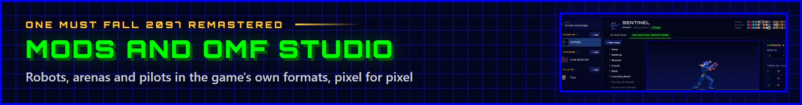

<p align="center"></p>

Mods add robots, arenas and pilots to One Must Fall 2097 Remastered. They are made with **OMF Studio**, the game's
modding tool, and shared as `.omfmod` files. A mod's content plays like the game's own: every animation, move and hit
point of a robot, every hazard of an arena, in classic and remastered graphics, in one and two player games, training,
the modes, replays and the move list.

- **Install a mod**: drop its `.omfmod` file on the game, or open **Extras › Mods** and press **I**. Mods are on once
  installed; **Extras › Mods** turns them on and off, saves them as files and removes them. Changes play from the next
  start (**R** restarts the game).
- **The remaster's new robots and arenas** (GLACIER, TEMPEST, HELIX and SPECTRE; Orbital, Ice Cave, Rooftop and
  Abyss) are a mod too, one that comes with the game: *New robots and arenas*, first on the Mods page, off until it is
  turned on there (or on the first start's setup screen). It cannot be removed, only turned off, and a mod installed
  with the same id takes its place. It is made with the same package format as any mod, so it is also the fullest
  example there is: OMF Studio opens a copy of it (**The new robots and arenas** on its start screen).
- **Make one**: open **Extras › OMF Studio** (the desktop app opens it in its own window; the installer can also add
  its shortcuts, and the exe opens it when started with `--studio` or named like `omf-studio.exe`), or `studio.html`
  next to the web version.

## OMF Studio

Studio makes content in the game's own formats, pixel for pixel, and tests it in the game itself. The mod's page says
what to do next (add something, fix what the checks find, or test the mod and share it) and shows what the mod holds;
the top bar says whether the game can play it (a click lists the checks, each one leading to what it is about). Every
robot, arena and pilot has a button that tests it in the game (**Fight with it**, **Fight in it**, **Play as them**).
Projects save themselves as they change (**Ctrl+S** saves at once), and any change can be taken back: **Undo** and
**Redo** in the top bar (**Ctrl+Z**, **Ctrl+Y**) go back and forth through the last 80 steps. A new robot, arena or
pilot can also start as a copy of one the mod already has, to make a variant of it.

- **Robots** start as a copy of one of the game's robots (the new ones included, with their HD pictures), from the
  robot workshop's parts (a 3D model posed and drawn into every frame, like the remaster's own robots), or as a blank
  figure to draw over. The editor has:
  - the robot's name, stats (health, endurance, speeds: each shown against the original robots', from the least to
    the most of them) and the special moves the computer uses for its tactics;
  - its moves: all 70 slots of its fighter file, each with its animation (a preview at the game's pace with the hit
    points, the frames and their tags, the raw animation string), its input (a builder: directions as they are
    entered, then the button), kind, damage, block stun, points, and the victim's reaction when it hits;
  - its sprites, drawn in the **pixel editor** in the game's palette (the pilot's three color ramps and the effect
    colors), with the frame before it as an onion skin, the floor line, and its hit points; pictures come in and out
    as PNG files (an indexed PNG exported by Studio keeps its colors exactly after editing it in another program);
  - its pictures on the robot select and VS screens (made from its idle frame, or drawn);
  - a list of what it still needs.
- **Arenas** start as a copy of one of the game's arenas (the new ones too, with their HD backgrounds), or from a
  picture (576 × 200 with the widescreen sides, or
  320 × 200): Studio picks the arena's 64 colors and makes the shading tables the game needs. An arena names its music
  (one of the game's songs, played in Studio with **Listen**), its ambience (the remastered effects and echo of one of the game's arenas) and, if any,
  the original arena whose built-in rules it follows. Its animations are the 50 slots of its scene file, edited over
  the arena's background like a robot's moves (frames, tags, sprites, hit points): scenery that loops from the start,
  hazards that appear at random during fights (their chance, damage and the robot's reaction when they hit), what an
  animation turns into when it hits a robot, ends, or is hit, and its sounds. An animation can be copied from another
  arena with the ones it starts and turns into (the Fire Pit's orbs come with their bursts), its colors matched to the
  arena's.
- **Pilots** start as a copy of one of the game's pilots (their portrait and face, stats, colors, words, ending and
  personality) or blank. The editor has:
  - the name, sex, stats and colors (shown on a robot), and the original pilot it plays like;
  - its portrait and face, drawn in the pixel editor in the pilot select screen's portrait colors or brought in as
    PNG, and shown as the pilot select, VS and ending screens show them (each screen draws it in its own colors);
  - its words, drawn in the game's font in the screens' boxes, which say when a text is too long for its box: the
    bio, its line on the VS screen to each of the original pilots and their answers, its lines after winning, and its
    ending;
  - the computer's personality when it fights as the pilot: how it goes about a fight, the attacks it likes, how it
    moves and how readily it learns the player's habits (the original pilots' as a start).
- **HD artwork** for the remastered look: the pictures it draws instead of upscaling the classic ones. A robot's or
  arena's **HD ARTWORK** card exports every sprite as a template (blown up to the HD size, in the colors the pictures
  are painted in) to paint over or run through an upscaler, and brings the pictures back in by their names (one by
  one or in a zip); a sprite's own HD picture, a background's and a pilot's portrait and face have a row of their own
  (**Import HD**, **HD template**). The animation preview shows the HD pictures (its **HD** box), sprites with one
  have an **HD** badge, and a picture follows its sprite when the sprite is drawn on. A robot built from the robot
  workshop's parts, or a copy of one of the remaster's robots, has its HD pictures rendered from its 3D model
  (**Render from the 3D model**), the way the game renders the remaster's own robots: every sprite still as the model
  drew it, in the colors the pictures are painted in.
- **Test** plays the mod in the game over Studio: a fight against the computer, the computer against itself,
  training, in any arena, or the one-player game from its pilot select screen, its VS screen (the pilot against one
  of the original ones) or its ending. The computer can fight as any pilot, the mod's own too (to try their
  personality), and the test's window shows what it starts with: both robots in their pilots' colors in the arena. **Build file** saves the `.omfmod` file to share; **Install in game** installs it on this
  computer. Projects save themselves as they change and are listed on Studio's start screen.

## The package format

A `.omfmod` file is a zip archive:

```
mod.json                         the manifest
robots/<id>/robot.json           a robot's name, texts and tactics
robots/<id>/fighter.af           its fighter file (the original AF format)
arenas/<id>/arena.json           an arena's name, texts, music, ambience and behavior
arenas/<id>/arena.bk             its scene file (the original BK format)
arenas/<id>/arena.wid            optional: its widescreen background
pilots/<id>/pilot.json           a pilot's name, stats, colors, style, words and ending
pilots/<id>/portrait.png         optional: its portrait
pilots/<id>/face.png             optional: its face in the pilot select grid
<robots|arenas|pilots>/<id>/hd.json   optional: its HD pictures (below), in hd/
```

`<id>` is a folder name: lower case letters, digits, `-` and `_` (32 characters at most). The archive's files may add
up to 1 GB unpacked.

### mod.json

| Field | |
|---|---|
| `format` | `1` (the package format; a game refuses formats newer than it reads) |
| `id` | the mod's id: lower case letters, digits, `.`, `-` and `_`, like `jane.steel-pack`. An update keeps it. |
| `name`, `version`, `author`, `description` | shown on the Mods page (40, 16, 40 and 400 characters at most) |
| `game` | the oldest game version it works with (`"0.2.0"`) |
| `robots`, `arenas`, `pilots` | the folder names of its content |

### robot.json

| Field | |
|---|---|
| `name` | up to 12 letters (upper case) |
| `description` | shown in the mech lab |
| `moves` | names of the special moves by move id, e.g. `{ "15": "DRILL RUSH" }` (the move list shows them) |
| `ai` | `{ "projectile": [...], "charge": [...], "push": [...] }`: move ids the computer uses for those tactics |
| `workshop` | optional: the robot workshop's parts it was built from (`body`, `head` and `moves`: 0-3, GLACIER, TEMPEST, HELIX, SPECTRE; `size` and `weight`: 0-2): the game turns the robot in the mech lab and renders its HD pictures from their 3D model where the mod has none (OMF Studio too) |

The fighter file must have the animations the engine plays: 1 jump, 2 stand up, 3 stunned, 4 crouch, 5 and 6 blocks,
9 the damage sheet, 10 walk, 11 idle, 48 victory and 49 defeat. Move 60 is the robot select screen's picture (51 × 36,
color `0xD0` see-through) and move 61 the VS screen's; without them the game makes them from the idle frame. The
effect moves every robot shares (7, 8, 12-14, 55-57) may be left out: the game uses the original game's. The file's
robot number is set by the game. The damage sheet has 24 sprites, A to X, in the originals' order: hits show the
victim's frames by their letter (one it has no sprite for shows nothing), so OMF Studio keeps its sprites from being
deleted. A sprite is at most 1024 pixels on a side.

Sprites use the pilot's color ramps (entries 1-15, 16-31 and 32-47: its tertiary, secondary and primary colors) and
the effect colors every fight has (`0xA0`-`0xF9`); 0 is see-through. Attacks are matched by their input string
(`P` or `K`, then the directions newest first, numpad style: `"P632"` is ↓ ↘ → Punch) in slot order, 15 to 69.

### arena.json

| Field | |
|---|---|
| `name`, `description`, `newsName` | the arena's name (16 letters), the VS screen's text, the news report's name |
| `music` | `ARENA0.PSM` … `ARENA4.PSM`, `MENU.PSM` or `END.PSM` |
| `ambience` | `none`, `stadium`, `danger room`, `power plant`, `fire pit`, `desert`, `orbital`, `ice cave`, `rooftop` or `abyss` |
| `base` | an original arena (0-4) whose built-in rules it follows (the Stadium's light, the Power Plant's walls, the Fire Pit's fire, the Desert's palette for each round), or `-1` |
| `loops` | optional: its animations (0-49) that start with the arena and loop, e.g. `[30]` |

The scene file's background is 320 × 200; the arena's own colors are palette entries `0x60`-`0x9F` (the rest, and the
round announcements and dust when it has none of its own, come from the original game's first arena; so does each
entry of its sound table left at 0). The widescreen file is the 576 × 200 picture (the middle 320 columns the classic
screen): width and height (16 bits each), then the pixels encoded like sprites.

The scene file's animations play in these ways:

- listed in `loops`: they start with the arena and loop. They are scenery: they never hurt anyone. They are drawn in
  the order of their numbers, so a later one made of the background's own pixels hides an earlier one where they
  overlap: scenery can pass behind parts of the arena that way (the new arenas' shuttle, submersible and shooting stars
  do, behind cut-outs of their window, dome and rocks).
- a probability above 1 makes a **hazard**: during fights with hazards on, it appears at its position with one chance
  in that number every tick (28 ms at the default speed), one at a time; one of its extra strings, picked at random,
  plays instead of its animation string (the first never does).
- the others play when an animation's `m` tag starts them (a probability of 1 makes them loop), or when the game does:
  6-11 the round announcements, 20 and 21 the walls a robot is slammed into, 22 the slam's effect on the robot, 24-26
  dust, 27 the round token.

A hazard, and what it starts, hurts a robot its hit points touch: its damage, the robot reacting as its reaction
string says (a move's footer string). It then turns into its next animation (the scene file's `chainNoHit`), as it
does when it ends; when a robot's attack hits it, it turns into its `chainHit` animation. Its sprites use the arena's
own colors and the effect colors (`0xA0`-`0xF9`); its `s n` tags play entry n of the arena's sound table (the game
sets entries 3, 14 and 15). A frame whose letter has no sprite shows nothing, in arenas and robots alike (the
originals use `Z`).

### pilot.json

| Field | |
|---|---|
| `name` | as the game writes names (`"Crystal"`), 16 characters at most |
| `sex` | `male` or `female` (the news report's words) |
| `power`, `agility`, `endurance` | 1-20 each |
| `colors` | the robot's colors: primary, secondary, tertiary (0-15, the game's color choices) |
| `bio` | the pilot select screen's text |
| `personality` | the original pilot it plays like (0 Crystal … 10 Kreissack): the computer fights like them without an `ai`, and the originals talk to it like to them on the VS screen without its `vs.from` |
| `ai` | optional: how the computer fights as the pilot (below) |
| `vs` | optional: its words on the one-player game's VS screen: `line` (to an opponent it has no line for), `to` (its line to each original pilot, by number: `{ "10": "..." }`), `from` (each original pilot's answer to it); 160 characters each |
| `quotes` | up to 10 lines after winning (the victory screen says one at random) |
| `ending` | the one-player game's ending: the story (a page a line), and the last line |

`portrait.png` is up to 160 × 160 (up to 88 × 69 shows as it is; the ending fits it into 86 × 61); `face.png` is
51 × 36, see-through around the head. Without `vs`, the VS screen's line is the first of `quotes`.

`ai` holds the personality fields of the original pilot records, all numbers (missing ones are 0):

| Field | |
|---|---|
| `normal`, `hyper`, `jump`, `defensive`, `sniper` | its attitudes, 0-100: fighting with basic moves, charging in, jumping in, defending, shooting from afar |
| `throws`, `specials`, `jumpAttacks`, `high`, `low`, `middle` | how much it likes each kind of attack, -100 to 100 |
| `moveJump`, `moveForward`, `moveBack` | how much it likes to jump, walk forward and walk back, -100 to 100 |
| `learning`, `forget` | how readily it learns the player's habits (0-15; the originals 0.7-3) and forgets them (0-3) |

### HD pictures (hd.json)

The remastered look draws a content's HD pictures instead of upscaling its classic pictures. They are 5 times as wide
and 6 times as tall as the classic pixels they stand for (the 320 × 200 screen shows at 4:3), or any size of that
shape at least twice as wide as the classic picture (larger ones are sharper; 4096 pixels a side at most), PNG or WebP
files in the content's `hd` folder. What `hd.json` holds (every field optional):

| Field | |
|---|---|
| `sprites` | robots and arenas: `{ "anim", "sprite", "file", "hash" }` for each sprite with an HD picture: a robot's move or an arena's animation, the sprite (0 = A), the picture, and the fingerprint of the sprite it was made for |
| `pad` | classic pixels of margin a sprite's picture covers around the sprite (0-8, 4 unless it says otherwise): a sprite of w × h has a picture of (w + 2 pad) × 5 by (h + 2 pad) × 6 |
| `colors` | robots: the robot colors the pictures are painted in (primary, secondary, tertiary: 0-15; 0, 1, 4 unless it says otherwise) |
| `background` | arenas: the whole background: 2880 × 1200 with the widescreen file (576 × 200), 1600 × 1200 without |
| `geometry` | arenas with a `background`: `{ "file", "floor", "far", "parallax" }`, the background's geometry map, a picture of its shape (any size, half is plenty): the surface direction in RGB (OpenGL normal map: x right, y up, z towards the viewer) and the depth in alpha (1 near, 0 far, not premultiplied); `floor` the depth of the floor the robots stand on, `far` how far its farthest parts still are (0 for a sky, about 0.3 for a room), `parallax` how much the camera's moves move it by its depth (0-1, 1 unless it says otherwise; 0 for thin things in front of far ones, which bend). The remastered effects light the background by its shape with it, and give it parallax. `tools/arena-geo.py --mod` makes one from the background with a depth model |
| `portrait`, `face` | pilots: the portrait (its portrait.png's shape, 5 × 6) and the face (255 × 216: a 51 × 36 face.png) |
| `mech` | robots built from the robot workshop's parts: `{ "file", "hash" }` for each of the twenty frames of the mech lab's turning robot, which the game draws from the robot's 3D model (the fingerprint of each frame's pixels; the picture covers the frame like a sprite's, `pad` around it). The game renders those frames itself unless the mod has every one (the new robots' mod has them: docs/BLENDER_SPRITES.md) |

The game recolors a robot's pictures from the colors they are painted in to each pilot's, keeping their shading and
highlights (it tells the robot's three color ramps apart by hue: paint them in three clearly different hues), and
fades, flashes and lights every picture through the palette changes of the classic one. `hash` (Studio writes it) is
the classic sprite's pixel fingerprint (src/video/hd/pixelHash.ts): a picture made for a sprite whose pixels changed
since is left out, as a picture for a sprite that does not exist or of the wrong shape is refused.

## How the game loads mods

At start-up the game reads the mods that come with it (`public/mods/index.json` lists them; a package is only
fetched when its mod is on) and every installed mod that is on, and checks them like OMF Studio does (the manifest,
every file's format, the animations a robot needs, the HD pictures' shapes). Each robot, arena and pilot gets a number the engine knows it by, and
keeps it (saved replays, records and the training setup name it): robots 24-63, arenas 9-31, pilots 16-63. The new
robots and arenas keep the numbers they had before they were a mod (robots 11-14, arenas 5-8), so replays and saves
from earlier versions still find them. A mod that cannot be loaded is left out, with its reason on the Mods page. A
replay of a fight with content of a mod that is off says so instead of playing, and a tournament pilot on a robot of
a mod that is off does not fight (the mech lab says which mod to turn on).

The code is in `src/mods` (the package format, the store, the registry, the Mods page) and `src/studio` (OMF Studio).
